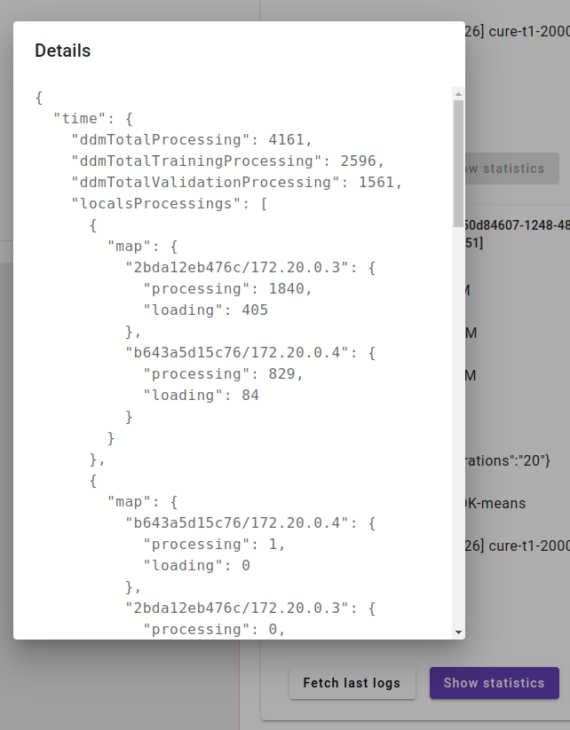

# DDM-PS-Eval platform

This platform has been developed for research purposes of the algorithms evaluation working in distributed environment especially with non-IID data partitioning.
It is a part of the PhD thesis [Evaluation of data partitioning strategies for distributed clustering and classification algorithms](https://repo.pw.edu.pl/info/phd/WUT065e1482656c4ad583f9cb37a0eee8b9).

Related publication: [Evaluation Platform for DDM Algorithms With the Usage of Non-Uniform Data Distribution Strategies](https://www.igi-global.com/article/evaluation-platform-for-ddm-algorithms-with-the-usage-of-non-uniform-data-distribution-strategies/290000)

# Setup and usage

In the current stage of the development there are two main possibilities to use the platform and its API.
Using development script located in [`./platform/coordinator/scripts/dev_setup.py`](./platform/coordinator/scripts/dev_setup.py) or via Web UI from [`./notebook/angular-web-ui/`](./notebook/angular-web-ui/)

First step is to build all artifacts:

- Coordinator app
- Docker images for workers which require Node Agent with its dependencies

The easiest way is to run [`./build-all.sh`](./platform/build-all.sh) script previously set up commands to switch java between `8` and `12` in [`./common-func.sh`](./platform/common-func.sh) file.
Current implementation use [SDKMAN](https://sdkman.io) switching versions.
[`./build-all.sh`](./platform/build-all.sh) script also prepares samples used in [development script](./platform/coordinator/scripts/dev_setup.py)

Then run Coordinator app as described in [README](./platform/coordinator/README.md) file.

## Using development script

The script to run experiments from the CLI is located in [`./platform/coordinator/scripts/dev_setup.py`](./platform/coordinator/scripts/dev_setup.py).
Script executes http requests to the coordinator using its API.

### Available commands

Scripts operate in multinode manner (by default) or onenode when added this string as the last argument.

It saves last used identifiers of instance/data/algorithm/etc. in `last_exec.properties` which allow to interact later.
The file looks like:

```properties
[last]
instance_id=a510c348-c2b9-4934-ae58-ed437731ada7
algorithm_id=1441092231
train_data_id=1334849234
test_data_id=1333828439
distance_function_id=163800118
partitioning_strategy_id=638174803
execution_id=1b6d42a8-aa8f-4e55-8938-16fe92d53b10
[onenode]
instance_id=48eaeccc-780d-440f-a688-ad0590a2c6d0
algorithm_id=356354599
train_data_id=2053030
test_data_id=371865426
distance_function_id=163800118
partitioning_strategy_id=638174803
execution_id=None
```

```bash
python dev_setup.py
```

```bash
Provide command! [setup, inststatus, confupdate, clear, reload, execute, status, logs, lastlog, results, validate, stats, schedule, partition, info [data, alg, func, strgy, exec, inst]]
```

- `setup` - creates an initial configuration
- `inststatus` - checks whenever all nodes are healthy
- `confupdate` - updates docker container local addresses of the created instances provided by node agents placed in containers - required for later communication
- `clear` - destroys all instances
- `reload` - reloads initial configuration
- `execute` - executes single experiment

```bash
startExecution instanceId='56e45c61-07e8-4e53-844b-8c0a39dc91f8' algorithmId='356353852' trainDataId='2053030' testDataId='371865426' distanceFuncName='none' params='None'
  executionId: c947b0ad-cb5f-47dd-bc23-3840cd927a4c
```

- `status` - check status of the last executed experiment

```bash
executionStatus executionId='fd17c2fc-1475-4612-baad-e5a09cbbc522'
{'algorithmId': '356353852',
 'appId': 'app-20240625205153-0001',
 'distanceFunctionId': None,
 'distanceFunctionName': 'none',
 'executionParams': '{"seed":"1719348712","groups":"6","iterations":"20","epsilon":"0.002","distanceFunctionName":"none","preCalcCentroids":"true","b":"2","meb_clusters":"-1","kernel":"rbf","knn_k":"3","init_kmeans_method":"k-means++","use_local_classifier":"false","branching_factor":"50","threshold":"0.01","g_groups":"7","g_threshold":"0.01","local_method_name":"only_with_svs","first_level_classification_result":"true"}',
 'id': 'fd17c2fc-1475-4612-baad-e5a09cbbc522',
 'instanceId': '56e45c61-07e8-4e53-844b-8c0a39dc91f8',
 'message': None,
 'started': '2024-06-25T22:51:51.548125',
 'status': 'STARTED',
 'stopped': None,
 'testDataId': '371865426',
 'trainDataId': '2053030',
 'updated': '2024-06-25T20:51:53.882'}
```

- `logs` - collects logs of the last executed experiment from the nodes
- `lastlog` - collects logs of the last executed experiment from the nodes and prints it (by default last 100 lines of logs are printed)

```bash
collectLogs executionId='fd17c2fc-1475-4612-baad-e5a09cbbc522'
  response: ok
fetchLogs executionId='fd17c2fc-1475-4612-baad-e5a09cbbc522' nodeId='worker-7b9fc799357d2e36107c8bc64400a5288ae0767976ed10d7e149e97f6c4cdf97' count='-100'
  response size: 786
fetchLogs executionId='fd17c2fc-1475-4612-baad-e5a09cbbc522' nodeId='master-0f4da2c1ea01e2c3650459c6686379a6f1cdcd6c93d5c562f302e77e2e9ef3ad' count='-100'
  response size: 2077


     =====================================================> worker [worker-7b9fc799357d2e36107c8bc64400a5288ae0767976ed10d7e149e97f6c4cdf97]
---------------------------------
-            PARAMS             -
---------------------------------
  knn_k=3
  b=2
  first_level_classification_result=true
  seed=1719348712
  preCalcCentroids=true
  kernel=rbf
  distanceFunctionName=none
  groups=6
  meb_clusters=-1
  local_method_name=only_with_svs
  threshold=0.01
  g_groups=7
  branching_factor=50
  iterations=20
  epsilon=0.002
  init_kmeans_method=k-means++
  use_local_classifier=false
  g_threshold=0.01
---------------------------------
  [[FUTURE LOG]] Found tag method for 'k-means++'
---------------------------------
-     K-means WEKA - CONFIG     -
---------------------------------
  groups        = 6
  iterations    = 20
  seed          = 1719348712
  initMethod    = k-means++
---------------------------------


     =====================================================> master [master-0f4da2c1ea01e2c3650459c6686379a6f1cdcd6c93d5c562f302e77e2e9ef3ad]
********************************
Reading args from json: {"masterNode":"0f4da2c1ea01:7077","workerNodes":"localhost:41499","instanceId":"56e45cUsing Spark's default log4j profile: org/apache/spark/log4j-defaults.properties
====== Models Summary:
  Local models:
  [0] local stage
[7b9fc799357d/192.168.96.3][0]: StringLocalModel(value=ackTime=1719348715928)
  Global models:
  Execution acknowledges:
[7b9fc799357d/192.168.96.3][null]: StringModel(value=clustering ok)
====== Dispersion Summary:
  Master address: 0f4da2c1ea01:7077 (onlyLocal)
  Available worker count: 1
    Used for local processing:
  [0] local stage
  Used workers (1/1):
[7b9fc799357d/192.168.96.3]: (1/1)
    Used for execution update:
  Used workers (1/1):
[7b9fc799357d/192.168.96.3]: (1/1)
====== Time Summary:
  Total time (ddm global): 00:00:00.280 (280ms)
  Total time without max data loading (ddm global): 00:00:00.276 (276ms)
  Total building time (local + global): 00:00:00.064 (64ms)
  Total building time loading (local + global): 00:00:00.003 (3ms)
  Total building time without loading (local + global): 00:00:00.061 (61ms)
  Total max building time without loading (max local + global): 00:00:00.064 (64ms)
  Total building time (global): 00:00:00.000 (0ms)
  Max building time (global): 00:00:00.000 (0ms)
  Total evaluation time: 00:00:00.009 (9ms)
  Total evaluation time loading: 00:00:00.001 (1ms)
  Total evaluation time without loading: 00:00:00.008 (8ms)
  Total max evaluation time without loading: 00:00:00.009 (9ms)
  Local processing (ms):
  [0] local stage
ExecutionStatisticsPersister.TimeStats.LocalStats(processing=64, loading=3)
  Global processing (ms):
0
  Local execution (ms):
ExecutionStatisticsPersister.TimeStats.LocalStats(processing=9, loading=1)
====== Transfer Summary:
  Local models (bytes):
  [0] local stage
127
  Global model (bytes):
====== Training Data avg size Summary:
  Local models (bytes):
  [0] local stage
54900
====== Custom Metrics Summary:
  Local models (metrics):
  [0] local stage
null
  Global model (bytes):
Parents of final stage: List()
```

- `results` - collects results of the last executed experiment from the nodes
- `validate` - validate experiments results with measures (by default uses `accuracy,recall,precision,f-measure,ARI` measures filtered by the type of algorithm)

```bash
validateResults executionId='fd17c2fc-1475-4612-baad-e5a09cbbc522' metrics='accuracy,recall,precision,f-measure,ARI'
  response: {"ARI":0.45013068566770514}
```

- `stats` - collects results and prints last executed experiment statistics

```bash
resultsStats executionId='fd17c2fc-1475-4612-baad-e5a09cbbc522'
{'custom': {'globals': [], 'locals': [{'7b9fc799357d/192.168.96.3': 'null'}]},
 'data': {'trainingBytes': 54900,
          'trainingsBytes': [{'7b9fc799357d/192.168.96.3': 54900}]},
 'time': {'ddmTotalProcessing': 280,
          'ddmTotalTrainingProcessing': 218,
          'ddmTotalValidationProcessing': 58,
          'ddmTotalWithoutMaxLoadings': 276,
          'executionLoading': 1,
          'globalProcessing': 0,
          'globalProcessings': [],
          'localLoading': 3,
          'localProcessing': 64,
          'localsExecutions': {'7b9fc799357d/192.168.96.3': {'loading': 1,
                                                             'processing': 9}},
          'localsProcessings': [{'map': {'7b9fc799357d/192.168.96.3': {'loading': 3,
                                                                       'processing': 64}}}],
          'maxExecution': 9,
          'maxExecutionLoading': 1,
          'maxGlobalProcessing': 0,
          'maxLocalLoading': 3,
          'maxLocalProcessing': 64,
          'total': 64,
          'totalExecution': 9,
          'totalExecutionWithoutLoading': 8,
          'totalMaxProcessing': 64,
          'totalWithoutLoading': 61},
 'transfer': {'globalBytes': 0,
              'globalMethodBytes': 0,
              'globalsBytes': [],
              'localBytes': 127,
              'localsBytes': [{'7b9fc799357d/192.168.96.3': 127}]}}
```

- `schedule` - execute configured experiments sequentially creating instances, loading artifacts and executing experiments

```bash
python dev_setup.py schedule
```

```bash
  instance: (3, 2, 4, 4) onenode: False
  Clearing previous and wait for setup....
 data: ('1334849234', '1333828439', 3)
   strategy: ('iid-u', 'uniform', 2022, '', True, None)
    execution: ('1441092231', {'groups': 3, 'iterations': '20', 'epsilon': '0.002', 'branching_factor': '50', 'threshold': '0.01', 'g_groups': 3, 'g_threshold': '0.01', 'b': '2', 'noOneGroup': 'false', 'minKGroups': 'true', 'exactKGroups': 'false', 'init_kmeans_method': 'k-means++', 'distanceFunctionName': 'euclidean'}, 'euclidean', None, True)
    [1 / 3] Wait for finish of: 78151f88-c2cc-4d34-a169-fcd64d36c898 ..
     METRICS: {'ARI': 0.7163421126838475}
         CSV_READY_HEADER data;nodes;strategy;strategyParams;algorithm;algorithmParams;kernel;mebClusters;use-local;first-level-only;multi-method;single-method;random-percent;close-to-percent;global-expand-percent;ARI;AMI;f-measure;accuracy;recall;precision;ddmTotalTrainingProcessing;sentSamples;allSamples;localBytes;globalBytes;globalMethodBytes;trainingBytes;ddmTotalProcessing;ddmTotalTrainingProcessing;ddmTotalValidationProcessing;localProcessing;globalProcessing;maxLocalProcessing;maxGlobalProcessing;localLoading;maxLocalLoading;executionLoading;maxExecutionLoading;total;totalMaxProcessing;totalExecution;maxExecution;totalWithoutLoading;totalExecutionWithoutLoading;ddmTotalWithoutMaxLoadings
         CSV_READY_VALUES ./samples/iris_numeric.data;3;iid-u;;d_dk-means;{'groups': 3, 'iterations': '20', 'epsilon': '0.002', 'branching_factor': '50', 'threshold': '0.01', 'g_groups': 3, 'g_threshold': '0.01', 'b': '2', 'noOneGroup': 'false', 'minKGroups': 'true', 'exactKGroups': 'false', 'init_kmeans_method': 'k-means++', 'distanceFunctionName': 'euclidean'};;;;;;;;;;0.7163421126838475;;;;;;979;0;0;1815;722;0;53547;1126;979;143;205;50;78;50;9;4;2;1;255;128;26;10;246;24;1121
    execution: ('1441092231', {'groups': 3, 'iterations': '20', 'epsilon': '0.002', 'branching_factor': '50', 'threshold': '0.01', 'g_groups': 3, 'g_threshold': '0.01', 'b': '2', 'noOneGroup': 'false', 'minKGroups': 'true', 'exactKGroups': 'false', 'init_kmeans_method': 'k-means++', 'distanceFunctionName': 'euclidean'}, 'euclidean', None, True)
    [2 / 3] Wait for finish of: deba0443-00c4-48c2-8cde-58f9aea5caf4 ..
     METRICS: {'ARI': 0.7561944834034596}
         CSV_READY_HEADER data;nodes;strategy;strategyParams;algorithm;algorithmParams;kernel;mebClusters;use-local;first-level-only;multi-method;single-method;random-percent;close-to-percent;global-expand-percent;ARI;AMI;f-measure;accuracy;recall;precision;ddmTotalTrainingProcessing;sentSamples;allSamples;localBytes;globalBytes;globalMethodBytes;trainingBytes;ddmTotalProcessing;ddmTotalTrainingProcessing;ddmTotalValidationProcessing;localProcessing;globalProcessing;maxLocalProcessing;maxGlobalProcessing;localLoading;maxLocalLoading;executionLoading;maxExecutionLoading;total;totalMaxProcessing;totalExecution;maxExecution;totalWithoutLoading;totalExecutionWithoutLoading;ddmTotalWithoutMaxLoadings
         CSV_READY_VALUES ./samples/iris_numeric.data;3;iid-u;;d_dk-means;{'groups': 3, 'iterations': '20', 'epsilon': '0.002', 'branching_factor': '50', 'threshold': '0.01', 'g_groups': 3, 'g_threshold': '0.01', 'b': '2', 'noOneGroup': 'false', 'minKGroups': 'true', 'exactKGroups': 'false', 'init_kmeans_method': 'k-means++', 'distanceFunctionName': 'euclidean'};;;;;;;;;;0.7561944834034596;;;;;;1000;0;0;1815;722;0;53547;1173;1000;168;228;50;91;50;9;3;1;1;278;141;30;11;269;29;1169
    execution: ('1441092231', {'groups': 3, 'iterations': '20', 'epsilon': '0.002', 'branching_factor': '50', 'threshold': '0.01', 'g_groups': 3, 'g_threshold': '0.01', 'b': '2', 'noOneGroup': 'false', 'minKGroups': 'true', 'exactKGroups': 'false', 'init_kmeans_method': 'k-means++', 'distanceFunctionName': 'euclidean'}, 'euclidean', None, True)
    [3 / 3] Wait for finish of: 29a5a090-2f82-4e7a-a942-f2b6ec02f5d7 ..
     METRICS: {'ARI': 0.4336957481259515}
         CSV_READY_HEADER data;nodes;strategy;strategyParams;algorithm;algorithmParams;kernel;mebClusters;use-local;first-level-only;multi-method;single-method;random-percent;close-to-percent;global-expand-percent;ARI;AMI;f-measure;accuracy;recall;precision;ddmTotalTrainingProcessing;sentSamples;allSamples;localBytes;globalBytes;globalMethodBytes;trainingBytes;ddmTotalProcessing;ddmTotalTrainingProcessing;ddmTotalValidationProcessing;localProcessing;globalProcessing;maxLocalProcessing;maxGlobalProcessing;localLoading;maxLocalLoading;executionLoading;maxExecutionLoading;total;totalMaxProcessing;totalExecution;maxExecution;totalWithoutLoading;totalExecutionWithoutLoading;ddmTotalWithoutMaxLoadings
         CSV_READY_VALUES ./samples/iris_numeric.data;3;iid-u;;d_dk-means;{'groups': 3, 'iterations': '20', 'epsilon': '0.002', 'branching_factor': '50', 'threshold': '0.01', 'g_groups': 3, 'g_threshold': '0.01', 'b': '2', 'noOneGroup': 'false', 'minKGroups': 'true', 'exactKGroups': 'false', 'init_kmeans_method': 'k-means++', 'distanceFunctionName': 'euclidean'};;;;;;;;;;0.4336957481259515;;;;;;970;0;0;1815;722;0;53547;1119;970;145;186;48;66;48;8;3;0;0;234;114;22;8;226;22;1116
  Clearing instances

SCHEDULE FINISHED
```

Best to use with e.g. `tee` program to pipe all results into textfile and then extract proper statistics into the CSV file:

```bash
time python dev_setup.py schedule | tee ./execlog.txt

grep 'CSV_READY_HEADER' ./execlog.txt -m 1 | sed -E 's/.+CSV_READY_HEADER //'
data;nodes;strategy;strategyParams;algorithm;algorithmParams;kernel;mebClusters;use-local;first-level-only;multi-method;single-method;random-percent;close-to-percent;global-expand-percent;ARI;AMI;f-measure;accuracy;recall;precision;ddmTotalTrainingProcessing;sentSamples;allSamples;localBytes;globalBytes;globalMethodBytes;trainingBytes;ddmTotalProcessing;ddmTotalTrainingProcessing;ddmTotalValidationProcessing;localProcessing;globalProcessing;maxLocalProcessing;maxGlobalProcessing;localLoading;maxLocalLoading;executionLoading;maxExecutionLoading;total;totalMaxProcessing;totalExecution;maxExecution;totalWithoutLoading;totalExecutionWithoutLoading;ddmTotalWithoutMaxLoadings

grep 'CSV_READY_VALUES' ./execlog.txt | sed -E 's/.+CSV_READY_VALUES //'
./samples/iris_numeric.data;3;iid-u;;d_dk-means;{'groups': 3, 'iterations': '20', 'epsilon': '0.002', 'branching_factor': '50', 'threshold': '0.01', 'g_groups': 3, 'g_threshold': '0.01', 'b': '2', 'noOneGroup': 'false', 'minKGroups': 'true', 'exactKGroups': 'false', 'init_kmeans_method': 'k-means++', 'distanceFunctionName': 'euclidean'};;;;;;;;;;0.7282217481230558;;;;;;1058;0;0;1815;722;0;53547;1201;1058;140;187;47;67;47;8;3;0;0;234;114;23;9;226;23;1198
./samples/iris_numeric.data;3;iid-u;;d_dk-means;{'groups': 3, 'iterations': '20', 'epsilon': '0.002', 'branching_factor': '50', 'threshold': '0.01', 'g_groups': 3, 'g_threshold': '0.01', 'b': '2', 'noOneGroup': 'false', 'minKGroups': 'true', 'exactKGroups': 'false', 'init_kmeans_method': 'k-means++', 'distanceFunctionName': 'euclidean'};;;;;;;;;;0.4303502505097334;;;;;;931;0;0;1815;722;0;53547;1012;931;78;209;49;84;49;8;3;3;1;258;133;26;11;250;23;1008
./samples/iris_numeric.data;3;iid-u;;d_dk-means;{'groups': 3, 'iterations': '20', 'epsilon': '0.002', 'branching_factor': '50', 'threshold': '0.01', 'g_groups': 3, 'g_threshold': '0.01', 'b': '2', 'noOneGroup': 'false', 'minKGroups': 'true', 'exactKGroups': 'false', 'init_kmeans_method': 'k-means++', 'distanceFunctionName': 'euclidean'};;;;;;;;;;0.43555882256614786;;;;;;961;0;0;1815;722;0;53547;1050;961;84;225;50;95;50;11;4;0;0;275;145;27;12;264;27;1046
```

- `partition` - perform loaded dataset partitioning with into given partitions using given strategy and parameters

```bash
python dev_setup.py partition 6 unbalancedness 'unbalancedness=0.1;nodeThreshold=4;proportional=0;' None 2022
```

```bash
partition
partitionData dataId='2053030' partitions='6' strategy='unbalancedness' strategyParams='unbalancedness=0.1;nodeThreshold=4;proportional=0;' distanceFunction='None' seed='2022'
  response: ["/tmp/splitter163480884258450813941719349687332-0","/tmp/splitter30710432926511085571719349687332-1","/tmp/splitter17758311751108745691719349687332-2","/tmp/splitter152211797699828094611719349687332-3","/tmp/splitter82377572373637579711719349687332-4","/tmp/splitter143370055994384256781719349687332-5"]
```

- `info [data, alg, func, strgy, exec, inst]` - prints information about chosen element of the system:
    - `data` - loaded datasets

```bash
dataInfo
{'2053030': {'attributesAmount': 4,
             'colTypes': ['numeric',
                          'numeric',
                          'numeric',
                          'numeric',
                          'numeric',
                          'nominal'],
             'id': '2053030',
             'idIndex': 0,
             'labelIndex': 5,
             'location': {'filesLocations': ['/tmp/coordinator/datasets/2053030.data'],
                          'numbersOfSamples': [150],
                          'sizesInBytes': [5039]},
             'numberOfSamples': 150,
             'originalName': './samples/iris.data',
             'separator': ',',
             'sizeInBytes': 5039,
             'type': 'data'},
 '371865426': {'attributesAmount': 4,
               'colTypes': ['numeric',
                            'numeric',
                            'numeric',
                            'numeric',
                            'numeric',
                            'nominal'],
               'id': '371865426',
               'idIndex': 0,
               'labelIndex': 5,
               'location': {'filesLocations': ['/tmp/coordinator/datasets/371865426.test'],
                            'numbersOfSamples': [15],
                            'sizesInBytes': [489]},
               'numberOfSamples': 15,
               'originalName': './samples/iris.test',
               'separator': ',',
               'sizeInBytes': 489,
               'type': 'test'}}
```

- `alg` - loaded algorithms

```bash
algorithmInfo
{'356353852': {'algorithmName': 'WEKA K-means',
               'algorithmType': 'clustering',
               'id': '356353852',
               'location': '/tmp/coordinator/algorithms/356353852.jar',
               'originalName': './samples/k-means-weka.jar',
               'packageName': 'ddm.sample',
               'pipeline': '{"stages":[{"stage":"LOCAL_UPDATE","stageIndex":0,"processorClassName":"ddm.sample.KmeansWeka"}]}',
               'sizeInBytes': 26461317}}
```

- `func` - loaded custom impl. of distance functions

```bash
functionsInfo
{'163800118': {'functionName': 'equality',
               'id': '163800118',
               'location': '/tmp/coordinator/distance_functions/163800118.jar',
               'originalName': './samples/equality-distance.jar',
               'packageName': 'ddm.samples',
               'sizeInBytes': 1119}}
```

- `strgy` - loaded custom impl. of partitioning strategies

```bash
strategiesInfo
{'638199099': {'id': '638199099',
               'location': '/tmp/coordinator/partitioner_strategies/638199099.jar',
               'originalName': './samples/dense-and-outliers-strategy.jar',
               'packageName': 'ddm.samples',
               'sizeInBytes': 5848290,
               'strategyName': 'dense-and-outliers'}}
```

- `exec` - executed experiments

```bash
executionInfo
{'c947b0ad-cb5f-47dd-bc23-3840cd927a4c': {'algorithmId': '356353852',
                                          'appId': 'app-20240625205136-0000',
                                          'distanceFunctionId': None,
                                          'distanceFunctionName': 'none',
                                          'executionParams': '{"seed":"1719348694","groups":"6","iterations":"20","epsilon":"0.002","distanceFunctionName":"none","preCalcCentroids":"true","b":"2","meb_clusters":"-1","kernel":"rbf","knn_k":"3","init_kmeans_method":"k-means++","use_local_classifier":"false","branching_factor":"50","threshold":"0.01","g_groups":"7","g_threshold":"0.01","local_method_name":"only_with_svs","first_level_classification_result":"true"}',
                                          'id': 'c947b0ad-cb5f-47dd-bc23-3840cd927a4c',
                                          'instanceId': '56e45c61-07e8-4e53-844b-8c0a39dc91f8',
                                          'masterAddr': {'address': 'localhost',
                                                         'agentPort': '34163',
                                                         'alive': True,
                                                         'cpu': 2,
                                                         'disk': 10,
                                                         'id': 'master-0f4da2c1ea01e2c3650459c6686379a6f1cdcd6c93d5c562f302e77e2e9ef3ad',
                                                         'localhostIp': '192.168.96.2',
                                                         'localhostName': '0f4da2c1ea01',
                                                         'master': True,
                                                         'memory': 4,
                                                         'name': 'platform-master-56e45c61-07e8-4e53-844b-8c0a39dc91f8',
                                                         'port': '45659',
                                                         'type': 'master',
                                                         'uiPort': '43221',
                                                         'worker': False},
                                          'message': None,
                                          'started': '2024-06-25T22:51:34.312231',
                                          'status': 'FINISHED',
                                          'stopped': '2024-06-25T20:51:39.036',
                                          'testDataId': '371865426',
                                          'trainDataId': '2053030',
                                          'updated': '2024-06-25T22:51:34.312909'},
 'fd17c2fc-1475-4612-baad-e5a09cbbc522': {'algorithmId': '356353852',
                                          'appId': 'app-20240625205153-0001',
                                          'distanceFunctionId': None,
                                          'distanceFunctionName': 'none',
                                          'executionParams': '{"seed":"1719348712","groups":"6","iterations":"20","epsilon":"0.002","distanceFunctionName":"none","preCalcCentroids":"true","b":"2","meb_clusters":"-1","kernel":"rbf","knn_k":"3","init_kmeans_method":"k-means++","use_local_classifier":"false","branching_factor":"50","threshold":"0.01","g_groups":"7","g_threshold":"0.01","local_method_name":"only_with_svs","first_level_classification_result":"true"}',
                                          'id': 'fd17c2fc-1475-4612-baad-e5a09cbbc522',
                                          'instanceId': '56e45c61-07e8-4e53-844b-8c0a39dc91f8',
                                          'masterAddr': {'address': 'localhost',
                                                         'agentPort': '34163',
                                                         'alive': True,
                                                         'cpu': 2,
                                                         'disk': 10,
                                                         'id': 'master-0f4da2c1ea01e2c3650459c6686379a6f1cdcd6c93d5c562f302e77e2e9ef3ad',
                                                         'localhostIp': '192.168.96.2',
                                                         'localhostName': '0f4da2c1ea01',
                                                         'master': True,
                                                         'memory': 4,
                                                         'name': 'platform-master-56e45c61-07e8-4e53-844b-8c0a39dc91f8',
                                                         'port': '45659',
                                                         'type': 'master',
                                                         'uiPort': '43221',
                                                         'worker': False},
                                          'message': None,
                                          'started': '2024-06-25T22:51:51.548125',
                                          'status': 'FINISHED',
                                          'stopped': '2024-06-25T20:51:56.163',
                                          'testDataId': '371865426',
                                          'trainDataId': '2053030',
                                          'updated': '2024-06-25T20:51:53.882'}}
```

- `inst` - current instances

```bash
instanceInfo
{'56e45c61-07e8-4e53-844b-8c0a39dc91f8': {'id': '56e45c61-07e8-4e53-844b-8c0a39dc91f8',
                                          'info': {'algorithmScatter': ['356353852'],
                                                   'dataScatter': {'2053030': {'distanceFunction': None,
                                                                               'seed': None,
                                                                               'strategyName': 'uniform',
                                                                               'strategyParams': None},
                                                                   '371865426': {'distanceFunction': None,
                                                                                 'seed': None,
                                                                                 'strategyName': 'dummy',
                                                                                 'strategyParams': None}}},
                                          'networkName': 'platform-network-56e45c61-07e8-4e53-844b-8c0a39dc91f8',
                                          'nodes': {'master-0f4da2c1ea01e2c3650459c6686379a6f1cdcd6c93d5c562f302e77e2e9ef3ad': {'address': 'localhost',
                                                                                                                                'agentPort': '34163',
                                                                                                                                'alive': True,
                                                                                                                                'containerId': '0f4da2c1ea01e2c3650459c6686379a6f1cdcd6c93d5c562f302e77e2e9ef3ad',
                                                                                                                                'cpu': 2,
                                                                                                                                'disk': 10,
                                                                                                                                'id': 'master-0f4da2c1ea01e2c3650459c6686379a6f1cdcd6c93d5c562f302e77e2e9ef3ad',
                                                                                                                                'localhostIp': '192.168.96.2',
                                                                                                                                'localhostName': '0f4da2c1ea01',
                                                                                                                                'memory': 4,
                                                                                                                                'name': 'platform-master-56e45c61-07e8-4e53-844b-8c0a39dc91f8',
                                                                                                                                'port': '45659',
                                                                                                                                'type': 'master',
                                                                                                                                'uiPort': '43221'},
                                                    'worker-7b9fc799357d2e36107c8bc64400a5288ae0767976ed10d7e149e97f6c4cdf97': {'address': 'localhost',
                                                                                                                                'agentPort': '44793',
                                                                                                                                'alive': True,
                                                                                                                                'containerId': '7b9fc799357d2e36107c8bc64400a5288ae0767976ed10d7e149e97f6c4cdf97',
                                                                                                                                'cpu': 2,
                                                                                                                                'disk': 10,
                                                                                                                                'id': 'worker-7b9fc799357d2e36107c8bc64400a5288ae0767976ed10d7e149e97f6c4cdf97',
                                                                                                                                'localhostIp': '192.168.96.3',
                                                                                                                                'localhostName': '7b9fc799357d',
                                                                                                                                'memory': 4,
                                                                                                                                'name': 'platform-worker-1-56e45c61-07e8-4e53-844b-8c0a39dc91f8',
                                                                                                                                'port': '41499',
                                                                                                                                'type': 'worker',
                                                                                                                                'uiPort': None}},
                                          'type': 'LOCAL_DOCKER'}}
```

### Usage

For now there are several places are marked with `FIXME setup..` strings where some parameters/data may be set.

#### Setup an instance with loaded samples

Basic usage is to setup single or multi node instance by using commands (missing `onenode` means multinode):

```bash
python dev_setup.py setup onenode
```

```bash
python dev_setup.py setup
```

```bash
loadJar path='./samples/dkmeans.jar'
  algorithmId: 1441092231
loadData path='./samples/iris.data' idIndex='None' labelIndex='4' separator=',' vectorizeStrings='False' percentage='None' seed='None' expandAmount='None'
  dataId: 2053030
loadData path='./samples/iris.test' idIndex='None' labelIndex='4' separator=',' vectorizeStrings='False' percentage='None' seed='None' expandAmount='None'
  dataId: 371865426
loadDistanceFunction path='./samples/equality-distance.jar'
  distanceFunctionId: 163800118
loadPartitioningStrategy path='./samples/dense-and-outliers-strategy.jar'
  partitioningStrategyId: 638199099
createInstance workers='4' cpu='2' workerMemory='3' masterMemory='3' disk='10'
  instanceId: 95f264b9-7d91-469b-8f77-ac6e102ec91b
Wait for setup.....
broadcastJar instanceId='95f264b9-7d91-469b-8f77-ac6e102ec91b' algorithmId='1441092231'
  response: ok_process-id
scatterData instanceId='95f264b9-7d91-469b-8f77-ac6e102ec91b' dataId='2053030' strategy='uniform' strategyParams='None' distanceFunction='None' typeCode='train' seed='None'
  response: ok_process-id
scatterData instanceId='95f264b9-7d91-469b-8f77-ac6e102ec91b' dataId='371865426' strategy='dummy' strategyParams='None' distanceFunction='None' typeCode='test' seed='None'
  response: ok_process-id
broadcastDistanceFunction instanceId='95f264b9-7d91-469b-8f77-ac6e102ec91b' distanceFunctionId='163800118'
  response: ok_process-id
instanceConfigUpdate instanceId='95f264b9-7d91-469b-8f77-ac6e102ec91b'
  response: ok
```

By default, sample configuration is loaded which is printed in the console and looks like this:

The actions done are quite informative:

1. `loadJar` - loads algorithm into Coordinator app
2. `loadData` - loads first datasets (for training purposes in this case)
3. `loadData` - loads second datasets (for testing purposes in this case)
4. `loadDistanceFunction` - loads custom impl. of distance function
5. `loadPartitioningStrategy` - loads custom impl. of partitioning strategy
6. `createInstance` - creates local instance with 4 workers (in this scenario)
7. dev script is actively waiting until all instances respond with OK healthcheck to the coordinator
8. `broadcastJar` - broadcasts loaded algorithm to the workers of created instance
9. `scatterData` - scatter dataset (training in this case) with uniform partitioning strategy
10. `scatterData` - scatter dataset (testing in this case) with dummy partitioning strategy as the scattering is uniform for test sets for evaluation performance
11. `broadcastDistanceFunction` - broadcast loaded distance function to the workers
12. `instanceConfigUpdate` - updates docker container local addresses of the created instances provided by node agents placed in containers - required for later communication

#### Run a defined experiment

```bash
python dev_setup.py execute
```

```bash
startExecution instanceId='95f264b9-7d91-469b-8f77-ac6e102ec91b' algorithmId='1441092231' trainDataId='2053030' testDataId='371865426' distanceFuncName='none' params='None'
  executionId: 3489f3de-cd55-4c3b-a19f-304016eb44c3
```

#### Check status of the execution

```bash
python dev_setup.py status
```

```bash
executionStatus executionId='3489f3de-cd55-4c3b-a19f-304016eb44c3'
{'algorithmId': '1441092231',
 'appId': 'app-20240625205909-0000',
 'distanceFunctionId': None,
 'distanceFunctionName': 'none',
 'executionParams': '{"seed":"1719349147","groups":"6","iterations":"20","epsilon":"0.002","distanceFunctionName":"none","preCalcCentroids":"true","b":"2","meb_clusters":"-1","kernel":"rbf","knn_k":"3","init_kmeans_method":"k-means++","use_local_classifier":"false","branching_factor":"50","threshold":"0.01","g_groups":"7","g_threshold":"0.01","local_method_name":"only_with_svs","first_level_classification_result":"true"}',
 'id': '3489f3de-cd55-4c3b-a19f-304016eb44c3',
 'instanceId': '95f264b9-7d91-469b-8f77-ac6e102ec91b',
 'message': None,
 'started': '2024-06-25T22:59:07.323878',
 'status': 'FINISHED',
 'stopped': '2024-06-25T20:59:14.209',
 'testDataId': '371865426',
 'trainDataId': '2053030',
 'updated': '2024-06-25T22:59:07.323908'}
```

#### Check last logs from the execution

```bash
python dev_setup.py lastlog
```

```bash
collectLogs executionId='3489f3de-cd55-4c3b-a19f-304016eb44c3'
  response: ok
fetchLogs executionId='3489f3de-cd55-4c3b-a19f-304016eb44c3' nodeId='worker-75a9db2507797a6f25adf959ee495e75c64e6fd5de88b4819435b19cd768eb59' count='-10'
  response size: 369
fetchLogs executionId='3489f3de-cd55-4c3b-a19f-304016eb44c3' nodeId='master-d871270a427fa1785d76c6122c07a9a4d21d5ac9bf740f66acc5b968d07a01cc' count='-10'
  response size: 134
fetchLogs executionId='3489f3de-cd55-4c3b-a19f-304016eb44c3' nodeId='worker-e51aaf4b63fcb95ddd7ad9040b345056ae510013d76e3e2be79285720129e568' count='-10'
  response size: 240
fetchLogs executionId='3489f3de-cd55-4c3b-a19f-304016eb44c3' nodeId='worker-746fafe95952ff239f80c69e72aca7400b34488e96bd4df6f3e4c5b548881691' count='-10'
  response size: 293
fetchLogs executionId='3489f3de-cd55-4c3b-a19f-304016eb44c3' nodeId='worker-389c85af03b4a409b714fd1d37941e214d9f3cd6bd664f948e4744da5664d95c' count='-10'
  response size: 240


     =====================================================> worker [worker-75a9db2507797a6f25adf959ee495e75c64e6fd5de88b4819435b19cd768eb59]
  branching_factor=50
  iterations=20
  epsilon=0.002
  init_kmeans_method=k-means++
  use_local_classifier=false
  g_threshold=0.01
---------------------------------
No distance function provided - using Euclidean as default.

error log-line:  2d6d80c-ceca-483b-b937-7880fda90abf/executor-87873f77-4c85-42b3-9252-29aa9e36f70b/spark-d7b116bd-8916-4fa9-b5e8-452fd900c2a7


     =====================================================> master [master-d871270a427fa1785d76c6122c07a9a4d21d5ac9bf740f66acc5b968d07a01cc]
null
  [1] local stage
null
null
null
null
  Global model (bytes):
  [0] global stage
null
AGScheduler: Parents of final stage: List()


     =====================================================> worker [worker-e51aaf4b63fcb95ddd7ad9040b345056ae510013d76e3e2be79285720129e568]
  g_groups=7
  branching_factor=50
  iterations=20
  epsilon=0.002
  init_kmeans_method=k-means++
  use_local_classifier=false
  g_threshold=0.01
---------------------------------
No distance function provided - using Euclidean as default.


     =====================================================> worker [worker-746fafe95952ff239f80c69e72aca7400b34488e96bd4df6f3e4c5b548881691]
  branching_factor=50
  iterations=20
  epsilon=0.002
  init_kmeans_method=k-means++
  use_local_classifier=false
  g_threshold=0.01
---------------------------------
No distance function provided - using Euclidean as default.

error log-line:  20:59:14 INFO BlockManager: BlockManager stopped


     =====================================================> worker [worker-389c85af03b4a409b714fd1d37941e214d9f3cd6bd664f948e4744da5664d95c]
  g_groups=7
  branching_factor=50
  iterations=20
  epsilon=0.002
  init_kmeans_method=k-means++
  use_local_classifier=false
  g_threshold=0.01
---------------------------------
No distance function provided - using Euclidean as default.
```

#### Validate results

```bash
python dev_setup.py validate
```

```bash
validateResults executionId='3489f3de-cd55-4c3b-a19f-304016eb44c3' metrics='accuracy,recall,precision,f-measure,ARI'
  response: {"ARI":0.5357855409953332}
```

#### Reload config

In function [`reload`](./platform/coordinator/scripts/dev_setup.py#L533) change values next to the given comments to:

- `# FIXME setup default reload algorithm` - load different algorithm
- `# FIXME setup default reload string vectorization` - enable data vectorisation
- `# FIXME setup default reload training percentage` - change data split percentage
- `# FIXME setup default reload training sample numerical data` - change training and testing datasets
- `# FIXME setup default reload training sample nominal data` - change training/testing dataset
- `# FIXME setup non-default one-time data for reload` - change execution parameters
- `# FIXME setup non-default one-time distance function for reload` - load different custom impl. of distance function
- `# FIXME setup non-default one-time partitioning strategy for reload` - load different custom impl. of partitioning strategy
- `# FIXME setup non-default seed for partitioning scatter when non-deterministic` - change default seed for the data partitioning
- `# FIXME setup non-default partitioning data scattering` - change data partitioning scattering for the experiment

Then execute experiment one more time using `execute` command

```bash
python dev_setup.py execute
python dev_setup.py validate
```

#### Schedule several experiments

'Scheduling' experiments works hierarchically by:

1. creating instance configuration
2. loading dataset
3. scattering partitioned dataset
4. executing parametrised experiments

In function [`schedule`](./platform/coordinator/scripts/dev_setup.py#L730) change values next to the given comments to:

- `# FIXME setup schedule data` - dataset ids
- `# FIXME setup schedule instances` - instance configurations
- `# FIXME setup schedule partitioning strategies to avoid in multi node execution` - avoid executing partitioning strategy on multi node experiment eg. `uniform` partitioning
- `# FIXME setup schedule load external partitioning strategy` - id of the custom impl. of partitioning strategy wanted to use withing 'scheduling'
- `# FIXME setup schedule uniform as default` - choose data partitioning strategies to setup in experiments and their parameters
- `# FIXME setup schedule one-node sample algorithms` - single node algorithms ids
- `# FIXME setup schedule multinode-node sample clustering algorithms` - multi node clustering algorithm ids
- `# FIXME setup schedule multinode-node sample classification algorithms` - multi node classification algorithm ids
- `# FIXME setup schedule default set of parameters to override` - default set of parameters that may be used in further setup
- `# FIXME setup schedule default execution multiplier` - how many times each experiment should be repeated
- `# FIXME setup schedule sample extend & override default params` - sample of the default parameters override

Then execute 'scheduled' experiments by executing `schedule` command:

```bash
time python dev_setup.py schedule | tee ./execlog.txt
grep 'CSV_READY_HEADER' ./execlog.txt -m 1 | sed -E 's/.+CSV_READY_HEADER //'
grep 'CSV_READY_VALUES' ./execlog.txt | sed -E 's/.+CSV_READY_VALUES //'
```

## Using Web UI

The Web UI app provides an interface which communicates with Coordinator app via same API like development script.
It is a bit raw, not fully styled yet and general UX improvements are in progress.

To run it requires to build & start [`./notebook/angular-web-ui/`](./notebook/angular-web-ui/) project.
Then UI is available on http://localhost:4200 by default and presents current coordinator state:


### Usage

At the beginning the new instance has to be created (by default newly created instance is selected as current):


After creation, it is required to update local addresses for the instance by checking its health (green refresh button indicated correct state):


Having instance, it is possible to load and broadcast some algorithms and broadcast it to current instance:


From the 'Data' tab it is also possible to load into the Coordinator app and broadcast other artifacts like custom distance function or partitioning strategy:


Custom distance function has to be broadcast to the instance for usage:


Using this tab it is possible to upload CSV data and then scatter it through worker nodes using chosen strategy.
For unsupervised learning algorithms training data is enough:


In the 'Instance' tab raw summary of an instance is presented.
What algorithms are loaded, some info about instance workers is presented and what data is currently scattered among workers:


Having such prepared instance we can run experiment.
Execution params has to be provided in JSON format:


Experiments that are executed are listed below with refresh button to check status and stop button to stop execution:


For each experiment execution arguments are presented together with timing information (docker dates might be shifted due to set timezone):


Depending on the processing state we can do several operations:

- check logs (always)
- show execution statistics (finished)
- validate and show results (finished)
- show error message (failed)

Logs are presented from every node separated by horizontal line:


Execution statistics contains processing time and data transfer information for every stage of the execution:



Validation action collects results and perform validation phase (for now with every method-type measures same as development script):


Full error message is presented on 'Message' text click:


All the execution results alongside uploaded data and other artifacts are stored in the Coordinator app path - by default in the temporary dir.

The 'Results' tab is currently unused:


To clear single instance trash icon has to be clicked with confirmation:


Before closing Coordinator app as described in [local setup](./platform/coordinator/README.md) it is better to clear all instances:


By default, on site load all configs related to instance/algorithms/data are reloaded.
However, it is possible to force reload them (e.g. because of multiple browser tabs) by using reload config buttons:


# TODO

- All TODO left in the code:
    - [ ] [experiments-panel.component.html](./angular-web-ui/src/app/components/experiments-panel/experiments-panel.component.html#L8) : TODO
    - [ ] [execution.component.ts](./angular-web-ui/src/app/components/experiments-panel/execution/execution.component.ts#L139) : TODO add data scatter info to form
    - [ ] [instance.component.html](./angular-web-ui/src/app/components/operation-panel/instance/instance.component.html#L139) : TODO distance function scatter-->
    - [ ] [data.component.html](./angular-web-ui/src/app/components/operation-panel/data/data.component.html#L82) : TODO FIXME LOADED..</mat-option>-->
    - [ ] [data.component.html](./angular-web-ui/src/app/components/operation-panel/data/data.component.html#L98) : TODO FIXME LOADED..</mat-option>-->
    - [ ] [Utils.java](./platform/strategies/src/main/java/pl/edu/pw/ddm/platform/strategies/utils/Utils.java#L48) : TODO optimize
    - [ ] [Utils.java](./platform/strategies/src/main/java/pl/edu/pw/ddm/platform/strategies/utils/Utils.java#L50) : TODO handle already partitioned
    - [ ] [Utils.java](./platform/strategies/src/main/java/pl/edu/pw/ddm/platform/strategies/utils/Utils.java#L59) : TODO optimize
    - [ ] [Utils.java](./platform/strategies/src/main/java/pl/edu/pw/ddm/platform/strategies/utils/Utils.java#L61) : TODO handle already partitioned
    - [ ] [UniformPartitionerStrategy.java](./platform/strategies/src/main/java/pl/edu/pw/ddm/platform/strategies/UniformPartitionerStrategy.java#L29) : TODO handle already partitioned files
    - [ ] [UniformPartitionerStrategy.java](./platform/strategies/src/main/java/pl/edu/pw/ddm/platform/strategies/UniformPartitionerStrategy.java#L55) : TODO handle already partitioned files
    - [ ] [UniformPartitionerStrategy.java](./platform/strategies/src/main/java/pl/edu/pw/ddm/platform/strategies/UniformPartitionerStrategy.java#L65) : TODO optimize
    - [ ] [DataDiscretizator.java](./platform/strategies/src/main/java/pl/edu/pw/ddm/platform/strategies/conceptdrift/DataDiscretizator.java#L47) : TODO handle non numerical exceptions..
    - [ ] [DataDiscretizator.java](./platform/strategies/src/main/java/pl/edu/pw/ddm/platform/strategies/conceptdrift/DataDiscretizator.java#L84) : TODO handle non numerical exceptions..
    - [ ] [DataDiscretizator.java](./platform/strategies/src/main/java/pl/edu/pw/ddm/platform/strategies/conceptdrift/DataDiscretizator.java#L98) : TODO more sophisticated thresholds according to value densities
    - [ ] [ConceptDriftPartitionerStrategy.java](./platform/strategies/src/main/java/pl/edu/pw/ddm/platform/strategies/conceptdrift/ConceptDriftPartitionerStrategy.java#L32) : TODO remove as it is exposed only for test chart purposes
    - [ ] [ConceptDriftPartitionerStrategy.java](./platform/strategies/src/main/java/pl/edu/pw/ddm/platform/strategies/conceptdrift/ConceptDriftPartitionerStrategy.java#L47) : TODO make it more sophisticated like to <0,1),<1,10> where cardinality is more equal
    - [ ] [ConceptDriftPartitionerStrategy.java](./platform/strategies/src/main/java/pl/edu/pw/ddm/platform/strategies/conceptdrift/ConceptDriftPartitionerStrategy.java#L72) : TODO handle already partitioned files
    - [ ] [ConceptDriftPartitionerStrategy.java](./platform/strategies/src/main/java/pl/edu/pw/ddm/platform/strategies/conceptdrift/ConceptDriftPartitionerStrategy.java#L91) : TODO optimize
    - [ ] [ConceptDriftPartitionerStrategy.java](./platform/strategies/src/main/java/pl/edu/pw/ddm/platform/strategies/conceptdrift/ConceptDriftPartitionerStrategy.java#L100) : TODO handle already partitioned files
    - [ ] [DriftBucketsPreparer.java](./platform/strategies/src/main/java/pl/edu/pw/ddm/platform/strategies/conceptdrift/DriftBucketsPreparer.java#L114) : TODO maybe add singularities in the buckets where the amount of data is the lowest?
    - [ ] [DriftBucketsPreparer.java](./platform/strategies/src/main/java/pl/edu/pw/ddm/platform/strategies/conceptdrift/DriftBucketsPreparer.java#L131) : TODO maybe here divide 2 drifts into 4 (equal 2 + 2) when 4 workers but what if not equal?
    - [ ] [DriftBucketsPreparer.java](./platform/strategies/src/main/java/pl/edu/pw/ddm/platform/strategies/conceptdrift/DriftBucketsPreparer.java#L168) : TODO somehow use previous independent singularities.size() in equation
    - [ ] [DriftBucketsPreparer.java](./platform/strategies/src/main/java/pl/edu/pw/ddm/platform/strategies/conceptdrift/DriftBucketsPreparer.java#L202) : TODO remove for non-tests as it is used only for charts
    - [ ] [DriftBucketsPreparer.java](./platform/strategies/src/main/java/pl/edu/pw/ddm/platform/strategies/conceptdrift/DriftBucketsPreparer.java#L222) : TODO remove for non-tests
    - [ ] [MostOfOnePlusSomePartitionerStrategy.java](./platform/strategies/src/main/java/pl/edu/pw/ddm/platform/strategies/mostof/MostOfOnePlusSomePartitionerStrategy.java#L96) : TODO optimize
    - [ ] [CovariateShiftPartitionerStrategy.java](./platform/strategies/src/main/java/pl/edu/pw/ddm/platform/strategies/covariateshift/CovariateShiftPartitionerStrategy.java#L47) : TODO add more features/shifts eg. 0.1|0.2 for features 2|4
    - [ ] [CovariateShiftPartitionerStrategy.java](./platform/strategies/src/main/java/pl/edu/pw/ddm/platform/strategies/covariateshift/CovariateShiftPartitionerStrategy.java#L106) : TODO handle already partitioned files
    - [ ] [CovariateShiftPartitionerStrategy.java](./platform/strategies/src/main/java/pl/edu/pw/ddm/platform/strategies/covariateshift/CovariateShiftPartitionerStrategy.java#L138) : TODO optimize
    - [ ] [CovariateShiftPartitionerStrategy.java](./platform/strategies/src/main/java/pl/edu/pw/ddm/platform/strategies/covariateshift/CovariateShiftPartitionerStrategy.java#L147) : TODO handle already partitioned files
    - [ ] [UnbalancedPartitionerStrategy.java](./platform/strategies/src/main/java/pl/edu/pw/ddm/platform/strategies/UnbalancedPartitionerStrategy.java#L92) : TODO handle already partitioned files
    - [ ] [UnbalancedPartitionerStrategy.java](./platform/strategies/src/main/java/pl/edu/pw/ddm/platform/strategies/UnbalancedPartitionerStrategy.java#L109) : TODO optimize
    - [ ] [DataShifter.java](./platform/strategies/src/main/java/pl/edu/pw/ddm/platform/strategies/conceptshift/DataShifter.java#L61) : TODO check all labels to avoid collision
    - [ ] [ConceptShiftPartitionerStrategy.java](./platform/strategies/src/main/java/pl/edu/pw/ddm/platform/strategies/conceptshift/ConceptShiftPartitionerStrategy.java#L57) : TODO handle already partitioned files
    - [ ] [ConceptShiftPartitionerStrategy.java](./platform/strategies/src/main/java/pl/edu/pw/ddm/platform/strategies/conceptshift/ConceptShiftPartitionerStrategy.java#L82) : TODO optimize
    - [ ] [ConceptShiftPartitionerStrategy.java](./platform/strategies/src/main/java/pl/edu/pw/ddm/platform/strategies/conceptshift/ConceptShiftPartitionerStrategy.java#L91) : TODO handle already partitioned files
    - [ ] [SeparateByLabelsPartitionerStrategy.java](./platform/strategies/src/main/java/pl/edu/pw/ddm/platform/strategies/SeparateByLabelsPartitionerStrategy.java#L40) : TODO handle already partitioned
    - [ ] [SeparateByLabelsPartitionerStrategy.java](./platform/strategies/src/main/java/pl/edu/pw/ddm/platform/strategies/SeparateByLabelsPartitionerStrategy.java#L51) : TODO optimize
    - [ ] [DdmAdjustedMutualInformation.java](./platform/metrics/src/main/java/pl/edu/pw/ddm/platform/metrics/DdmAdjustedMutualInformation.java#L13) : TODO add other normalizer options like sqrt, min, max
    - [ ] [DataProvider.java](./platform/model-interface/src/main/java/pl/edu/pw/ddm/platform/interfaces/data/DataProvider.java#L8) : TODO data lazy/partial loading
    - [ ] [ExecutionStatisticsPersister.java](./platform/app-runner-java/src/main/java/pl/edu/pw/ddm/platform/runner/utils/ExecutionStatisticsPersister.java#L205) : TODO add preprocessing etc.
    - [ ] [ExecutionStatusPersister.java](./platform/app-runner-java/src/main/java/pl/edu/pw/ddm/platform/runner/utils/ExecutionStatusPersister.java#L41) : TODO handle errors somehow by catching it and rethrowing
    - [ ] [TransferSizeUtil.java](./platform/app-runner-java/src/main/java/pl/edu/pw/ddm/platform/runner/utils/TransferSizeUtil.java#L13) : TODO make it more exact
    - [ ] [TransferSizeUtil.java](./platform/app-runner-java/src/main/java/pl/edu/pw/ddm/platform/runner/utils/TransferSizeUtil.java#L15) : TODO remove base class serialization size
    - [ ] [JsonArgsDto.java](./platform/app-runner-java/src/main/java/pl/edu/pw/ddm/platform/runner/JsonArgsDto.java#L38) : TODO FIXME compatibility but currently node-agent and AlgConfig is required so this is redundant check
    - [ ] [LocalExecutionRunner.java](./platform/app-runner-java/src/main/java/pl/edu/pw/ddm/platform/runner/LocalExecutionRunner.java#L62) : TODO lazy loading to avoid such an error with collecting duration
    - [ ] [LocalExecutionRunner.java](./platform/app-runner-java/src/main/java/pl/edu/pw/ddm/platform/runner/LocalExecutionRunner.java#L80) : TODO think if not test for clustering means eg training
    - [ ] [LocalExecutionRunner.java](./platform/app-runner-java/src/main/java/pl/edu/pw/ddm/platform/runner/LocalExecutionRunner.java#L81) : TODO lazy loading to avoid such an error with collecting duration
    - [ ] [CentralRunner.java](./platform/app-runner-java/src/main/java/pl/edu/pw/ddm/platform/runner/CentralRunner.java#L58) : TODO think if not remove or sth and log.info it
    - [ ] [CentralRunner.java](./platform/app-runner-java/src/main/java/pl/edu/pw/ddm/platform/runner/CentralRunner.java#L81) : TODO args with num dataId and maybe start parameters
    - [ ] [CentralRunner.java](./platform/app-runner-java/src/main/java/pl/edu/pw/ddm/platform/runner/CentralRunner.java#L92) : TODO Improve catching exception per node or sth similar
    - [ ] [CentralRunner.java](./platform/app-runner-java/src/main/java/pl/edu/pw/ddm/platform/runner/CentralRunner.java#L96) : TODO get failed node address from exception message or from sc if possible
    - [ ] [CentralRunner.java](./platform/app-runner-java/src/main/java/pl/edu/pw/ddm/platform/runner/CentralRunner.java#L106) : TODO send clear ID to every agent
    - [ ] [LocalUpdateRunner.java](./platform/app-runner-java/src/main/java/pl/edu/pw/ddm/platform/runner/LocalUpdateRunner.java#L65) : TODO FIXME not always required when localProcess is present
    - [ ] [NodeDataProvider.java](./platform/app-runner-java/src/main/java/pl/edu/pw/ddm/platform/runner/data/NodeDataProvider.java#L24) : TODO think about, both might be same named as they have different ids
    - [ ] [NodeDataProvider.java](./platform/app-runner-java/src/main/java/pl/edu/pw/ddm/platform/runner/data/NodeDataProvider.java#L139) : TODO check if same types
    - [ ] [NodeDataProvider.java](./platform/app-runner-java/src/main/java/pl/edu/pw/ddm/platform/runner/data/NodeDataProvider.java#L149) : TODO improve loading data
    - [ ] [NodeDataProvider.java](./platform/app-runner-java/src/main/java/pl/edu/pw/ddm/platform/runner/data/NodeDataProvider.java#L152) : TODO log
    - [ ] [NodeDataProvider.java](./platform/app-runner-java/src/main/java/pl/edu/pw/ddm/platform/runner/data/NodeDataProvider.java#L169) : TODO Array.copy as label always will be placed at the end such as index on the first place
    - [ ] [NodeData.java](./platform/app-runner-java/src/main/java/pl/edu/pw/ddm/platform/runner/data/NodeData.java#L18) : TODO think how to optimize
    - [ ] [NodeData.java](./platform/app-runner-java/src/main/java/pl/edu/pw/ddm/platform/runner/data/NodeData.java#L66) : TODO implement
    - [ ] [NodeData.java](./platform/app-runner-java/src/main/java/pl/edu/pw/ddm/platform/runner/data/NodeData.java#L75) : TODO optimize
    - [ ] [NodeData.java](./platform/app-runner-java/src/main/java/pl/edu/pw/ddm/platform/runner/data/NodeData.java#L84) : TODO implement
    - [ ] [NodeData.java](./platform/app-runner-java/src/main/java/pl/edu/pw/ddm/platform/runner/data/NodeData.java#L89) : TODO think about purpose
    - [ ] [NodeResultCollector.java](./platform/app-runner-java/src/main/java/pl/edu/pw/ddm/platform/runner/data/NodeResultCollector.java#L41) : TODO optimize and optimize sorting not only by integer indexes
    - [ ] [application.yml](./platform/node-agent/src/main/resources/application.yml#L23) : TODO AppAlgorithmsConfig include as dependency and run
    - [ ] [application-nodemaster.yml](./platform/node-agent/src/main/resources/application-nodemaster.yml#L1) : TODO AppAlgorithmsConfig make it deps
    - [ ] [SparkHealthCheckService.java](./platform/node-agent/src/main/java/pl/edu/pw/ddm/platform/agent/healthcheck/SparkHealthCheckService.java#L12) : TODO check if spark master/worker is working connected etc
    - [ ] [LocalWorkerExecutionLogsProvider.java](./platform/node-agent/src/main/java/pl/edu/pw/ddm/platform/agent/execution/LocalWorkerExecutionLogsProvider.java#L59) : TODO optimize and move to reading from one logger file
    - [ ] [LocalAlgorithmLoader.java](./platform/node-agent/src/main/java/pl/edu/pw/ddm/platform/agent/algorithm/LocalAlgorithmLoader.java#L91) : TODO clear on destroy when no docker?
    - [ ] [LocalExecutionStatusPersister.java](./platform/node-agent/src/main/java/pl/edu/pw/ddm/platform/agent/runner/LocalExecutionStatusPersister.java#L27) : TODO make common save model with app-runner-java as this class is copy
    - [ ] [AppRunner.java](./platform/node-agent/src/main/java/pl/edu/pw/ddm/platform/agent/runner/AppRunner.java#L66) : TODO extract all sparkXXX to properties component
    - [ ] [AppRunner.java](./platform/node-agent/src/main/java/pl/edu/pw/ddm/platform/agent/runner/AppRunner.java#L121) : TODO make one log with marked errors
    - [ ] [AppRunner.java](./platform/node-agent/src/main/java/pl/edu/pw/ddm/platform/agent/runner/AppRunner.java#L153) : TODO optionally add predefined if requested
    - [ ] [AppRunner.java](./platform/node-agent/src/main/java/pl/edu/pw/ddm/platform/agent/runner/AppRunner.java#L186) : TODO make use of arguments
    - [ ] [AppRunner.java](./platform/node-agent/src/main/java/pl/edu/pw/ddm/platform/agent/runner/AppRunner.java#L191) : TODO check for events if really stopped and eventually kill it
    - [ ] [AppRunner.java](./platform/node-agent/src/main/java/pl/edu/pw/ddm/platform/agent/runner/AppRunner.java#L240) : TODO check those worker address are correct from coordinator point of view not from docker
    - [ ] [AppRunner.java](./platform/node-agent/src/main/java/pl/edu/pw/ddm/platform/agent/runner/AppRunner.java#L258) : TODO also https?
    - [ ] [AppRunner.java](./platform/node-agent/src/main/java/pl/edu/pw/ddm/platform/agent/runner/AppRunner.java#L269) : TODO remove execution artifacts on destroy? when no docker
    - [ ] [AppHandleListener.java](./platform/node-agent/src/main/java/pl/edu/pw/ddm/platform/agent/runner/AppHandleListener.java#L11) : TODO use appId from here instead of app-runner status file
    - [ ] [ResultsController.java](./platform/node-agent/src/main/java/pl/edu/pw/ddm/platform/agent/api/ResultsController.java#L35) : TODO define model
    - [ ] [ExecutionController.java](./platform/node-agent/src/main/java/pl/edu/pw/ddm/platform/agent/api/ExecutionController.java#L33) : TODO think about request params and post dto due to another parameters
    - [ ] [ExecutionController.java](./platform/node-agent/src/main/java/pl/edu/pw/ddm/platform/agent/api/ExecutionController.java#L45) : TODO change response
    - [ ] [ExecutionController.java](./platform/node-agent/src/main/java/pl/edu/pw/ddm/platform/agent/api/ExecutionController.java#L50) : TODO move to request as body for auto populate
    - [ ] [ExecutionController.java](./platform/node-agent/src/main/java/pl/edu/pw/ddm/platform/agent/api/ExecutionController.java#L65) : TODO think about return messages
    - [ ] [ExecutionController.java](./platform/node-agent/src/main/java/pl/edu/pw/ddm/platform/agent/api/ExecutionController.java#L80) : TODO define model
    - [ ] [LocalDistanceFunctionLoader.java](./platform/node-agent/src/main/java/pl/edu/pw/ddm/platform/agent/data/LocalDistanceFunctionLoader.java#L91) : TODO remove on destroy? when no docker
    - [ ] [LocalDataLoader.java](./platform/node-agent/src/main/java/pl/edu/pw/ddm/platform/agent/data/LocalDataLoader.java#L58) : TODO remove after destroy? when not docker
    - [ ] [Clusterer.java](./platform/algorithms/samples/k-means-weka/src/main/java/ddm/sample/Clusterer.java#L113) : TODO remove debug checker
    - [ ] [README.md](./platform/algorithms/samples/k-means-weka/README.md#L8) : describe and impl. ::availableParameters method
    - [ ] [README.md](./platform/algorithms/samples/svm-weka/README.md#L7) : describe and impl. ::availableParameters method
    - [ ] [DenseAndOutliersStrategy.java](./platform/algorithms/samples/dense-and-outliers-strategy/src/main/java/ddm/samples/DenseAndOutliersStrategy.java#L30) : TODO FIXME required as current classloader does not load used transitive classes
    - [ ] [DenseAndOutliersStrategy.java](./platform/algorithms/samples/dense-and-outliers-strategy/src/main/java/ddm/samples/DenseAndOutliersStrategy.java#L57) : TODO handle already partitioned
    - [ ] [DenseAndOutliersStrategy.java](./platform/algorithms/samples/dense-and-outliers-strategy/src/main/java/ddm/samples/DenseAndOutliersStrategy.java#L82) : TODO deep copy check
    - [ ] [DenseAndOutliersStrategy.java](./platform/algorithms/samples/dense-and-outliers-strategy/src/main/java/ddm/samples/DenseAndOutliersStrategy.java#L111) : TODO optimize
    - [ ] [README.md](./platform/algorithms/samples/dense-and-outliers-strategy/README.md#L8) : describe and impl. ::availableParameters method
    - [ ] [README.md](./platform/algorithms/clustering/lct/README.md#L7) : describe and impl. ::availableParameters method
    - [ ] [README.md](./platform/algorithms/clustering/dkmeans/README.md#L7) : describe and impl. ::availableParameters method
    - [ ] [DBirch.java](./platform/algorithms/clustering/dbirch/src/main/java/pl/edu/pw/ddm/platform/algorithms/clustering/dbirch/DBirch.java#L46) : TODO custom impl or make it available to use one of predefined distance functions as used in clustering phase
    - [ ] [DBirch.java](./platform/algorithms/clustering/dbirch/src/main/java/pl/edu/pw/ddm/platform/algorithms/clustering/dbirch/DBirch.java#L97) : TODO custom impl or make it available to use one of predefined distance functions as used in clustering phase
    - [ ] [Base.java](./platform/algorithms/clustering/aoptkm/src/main/java/pl/edu/pw/ddm/platform/algorithms/clustering/aoptkm/Base.java#L138) : TODO restore after guava collisions fixed
    - [ ] [Base.java](./platform/algorithms/clustering/aoptkm/src/main/java/pl/edu/pw/ddm/platform/algorithms/clustering/aoptkm/Base.java#L270) : TODO normalization removed
    - [ ] [Base.java](./platform/algorithms/clustering/aoptkm/src/main/java/pl/edu/pw/ddm/platform/algorithms/clustering/aoptkm/Base.java#L392) : TODO restore after guava collisions fixed
    - [ ] [OpticsDkm.java](./platform/algorithms/clustering/aoptkm/src/main/java/pl/edu/pw/ddm/platform/algorithms/clustering/aoptkm/OpticsDkm.java#L47) : TODO FIXME remove
    - [ ] [OpticsDkm.java](./platform/algorithms/clustering/aoptkm/src/main/java/pl/edu/pw/ddm/platform/algorithms/clustering/aoptkm/OpticsDkm.java#L50) : TODO FIXME remove
    - [ ] [AutoOpticsKm.java](./platform/algorithms/clustering/aoptkm/src/main/java/pl/edu/pw/ddm/platform/algorithms/clustering/aoptkm/AutoOpticsKm.java#L45) : TODO remove debug checker
    - [ ] [AutoOpticsKm.java](./platform/algorithms/clustering/aoptkm/src/main/java/pl/edu/pw/ddm/platform/algorithms/clustering/aoptkm/AutoOpticsKm.java#L76) : TODO FIXME remove
    - [ ] [AutoOpticsKm.java](./platform/algorithms/clustering/aoptkm/src/main/java/pl/edu/pw/ddm/platform/algorithms/clustering/aoptkm/AutoOpticsKm.java#L79) : TODO FIXME remove
    - [ ] [Optics.java](./platform/algorithms/clustering/aoptkm/optics/src/main/java/pl/edu/pw/ddm/platform/algorithms/clustering/aoptkm/optics/Optics.java#L27) : TODO restore after guava collisions fixed
    - [ ] [Kmeans.java](./platform/algorithms/clustering/aoptkm/kmeans/src/main/java/pl/edu/pw/ddm/platform/algorithms/clustering/aoptkm/kmeans/Kmeans.java#L39) : TODO restore after guava collisions fixed
    - [ ] [Kmeans.java](./platform/algorithms/clustering/aoptkm/kmeans/src/main/java/pl/edu/pw/ddm/platform/algorithms/clustering/aoptkm/kmeans/Kmeans.java#L130) : TODO think about - different approach
    - [ ] [README.md](./platform/algorithms/clustering/aoptkm/README.md#L7) : describe and impl. ::availableParameters method
    - [ ] [MEBCluster.java](./platform/algorithms/classification/dmeb-2/src/main/java/pl/edu/pw/ddm/platform/algorithms/classification/dmeb2/utils/MEBCluster.java#L31) : TODO make use of the function after removing weka impl.
    - [ ] [DMeb2.java](./platform/algorithms/classification/dmeb-2/src/main/java/pl/edu/pw/ddm/platform/algorithms/classification/dmeb2/DMeb2.java#L116) : TODO FIXME optimize but here we've got non returned new Random().ints() 'stream'
    - [ ] [README.md](./platform/algorithms/classification/dmeb-2/README.md#L7) : describe and impl. ::availableParameters method
    - [ ] [MEBCluster.java](./platform/algorithms/classification/dmeb/src/main/java/pl/edu/pw/ddm/platform/algorithms/classification/dmeb/utils/MEBCluster.java#L23) : TODO make use of the function after removing weka impl.
    - [ ] [README.md](./platform/algorithms/classification/dmeb/README.md#L7) : describe and impl. ::availableParameters method
    - [ ] [GlobalClassifier.java](./platform/algorithms/classification/naive-bayes/src/main/java/pl/edu/pw/ddm/platform/algorithm/classification/naivebayes/GlobalClassifier.java#L20) : TODO add other distributions
    - [ ] [README.md](./platform/algorithms/classification/naive-bayes/README.md#L7) : describe and impl. ::availableParameters method
    - [ ] [Cluster.java](./platform/algorithms/classification/svm-2lvl/src/main/java/pl/edu/pw/ddm/platform/algorithm/classification/svm2lvl/utils/Cluster.java#L22) : TODO remove
    - [ ] [Cluster.java](./platform/algorithms/classification/svm-2lvl/src/main/java/pl/edu/pw/ddm/platform/algorithm/classification/svm2lvl/utils/Cluster.java#L27) : TODO make use of the function after removing weka impl.
    - [ ] [GlobalClassifier.java](./platform/algorithms/classification/svm-2lvl/src/main/java/pl/edu/pw/ddm/platform/algorithm/classification/svm2lvl/GlobalClassifier.java#L95) : TODO fixme group couintng
    - [ ] [README.md](./platform/algorithms/classification/svm-2lvl/README.md#L7) : describe and impl. ::availableParameters method
    - [ ] [build.gradle](./platform/coordinator/build.gradle#L59) : TODO FIXME why not loaded as transitive?
    - [ ] [LocalLogsCollector.java](./platform/coordinator/src/main/java/pl/edu/pw/ddm/platform/core/execution/LocalLogsCollector.java#L47) : TODO check if already has results downloaded
    - [ ] [LocalLogsCollector.java](./platform/coordinator/src/main/java/pl/edu/pw/ddm/platform/core/execution/LocalLogsCollector.java#L50) : TODO optimize
    - [ ] [LocalLogsCollector.java](./platform/coordinator/src/main/java/pl/edu/pw/ddm/platform/core/execution/LocalLogsCollector.java#L86) : TODO optimize
    - [ ] [ExecutionResultsFacade.java](./platform/coordinator/src/main/java/pl/edu/pw/ddm/platform/core/execution/ExecutionResultsFacade.java#L41) : TODO collect first if not done yet
    - [ ] [InMemoryExecutionStarter.java](./platform/coordinator/src/main/java/pl/edu/pw/ddm/platform/core/execution/InMemoryExecutionStarter.java#L34) : TODO broadcast algorithm if not present there
    - [ ] [InMemoryExecutionStarter.java](./platform/coordinator/src/main/java/pl/edu/pw/ddm/platform/core/execution/InMemoryExecutionStarter.java#L35) : TODO broadcast distance function if not present there
    - [ ] [InMemoryExecutionStarter.java](./platform/coordinator/src/main/java/pl/edu/pw/ddm/platform/core/execution/InMemoryExecutionStarter.java#L77) : TODO add null check
    - [ ] [InMemoryExecutionStarter.java](./platform/coordinator/src/main/java/pl/edu/pw/ddm/platform/core/execution/InMemoryExecutionStarter.java#L79) : TODO use appId in the future
    - [ ] [InMemoryExecutionStarter.java](./platform/coordinator/src/main/java/pl/edu/pw/ddm/platform/core/execution/InMemoryExecutionStarter.java#L82) : TODO check status before request - it may be not necessary
    - [ ] [InMemoryExecutionStarter.java](./platform/coordinator/src/main/java/pl/edu/pw/ddm/platform/core/execution/InMemoryExecutionStarter.java#L93) : TODO add null check
    - [ ] [LocalResultsCollector.java](./platform/coordinator/src/main/java/pl/edu/pw/ddm/platform/core/execution/LocalResultsCollector.java#L76) : TODO check if already has results downloaded
    - [ ] [LocalResultsCollector.java](./platform/coordinator/src/main/java/pl/edu/pw/ddm/platform/core/execution/LocalResultsCollector.java#L89) : TODO optimize
    - [ ] [LocalResultsCollector.java](./platform/coordinator/src/main/java/pl/edu/pw/ddm/platform/core/execution/LocalResultsCollector.java#L102) : TODO move to loader or sth
    - [ ] [LocalResultsCollector.java](./platform/coordinator/src/main/java/pl/edu/pw/ddm/platform/core/execution/LocalResultsCollector.java#L112) : TODO move to loader or sth
    - [ ] [LocalResultsCollector.java](./platform/coordinator/src/main/java/pl/edu/pw/ddm/platform/core/execution/LocalResultsCollector.java#L184) : TODO refactor a bit and save as .json
    - [ ] [LocalResultsCollector.java](./platform/coordinator/src/main/java/pl/edu/pw/ddm/platform/core/execution/LocalResultsCollector.java#L185) : TODO save cpu & memory info -> instance config - EDIT: already present with workers and master cpu&memory info in description
    - [ ] [ExecutionFacade.java](./platform/coordinator/src/main/java/pl/edu/pw/ddm/platform/core/execution/ExecutionFacade.java#L44) : TODO for spark impl. should find lowest params but currently all workers has the same if created locally in dockers
    - [ ] [ExecutionFacade.java](./platform/coordinator/src/main/java/pl/edu/pw/ddm/platform/core/execution/ExecutionFacade.java#L49) : TODO choose both by name or id, check if such name is loaded -> nameOrId
    - [ ] [ExecutionFacade.java](./platform/coordinator/src/main/java/pl/edu/pw/ddm/platform/core/execution/ExecutionFacade.java#L60) : TODO add precondition to avoid both distance function id and name which does not match id
    - [ ] [ExecutionFacade.java](./platform/coordinator/src/main/java/pl/edu/pw/ddm/platform/core/execution/ExecutionFacade.java#L62) : TODO handle when cpu/memory not equal for all
    - [ ] [ExecutionFacade.java](./platform/coordinator/src/main/java/pl/edu/pw/ddm/platform/core/execution/ExecutionFacade.java#L89) : TODO remove debug
    - [ ] [AlgorithmFacade.java](./platform/coordinator/src/main/java/pl/edu/pw/ddm/platform/core/algorithm/AlgorithmFacade.java#L53) : TODO more checks
    - [ ] [AlgorithmFacade.java](./platform/coordinator/src/main/java/pl/edu/pw/ddm/platform/core/algorithm/AlgorithmFacade.java#L61) : TODO remove debug
    - [ ] [LocalAlgorithmLoader.java](./platform/coordinator/src/main/java/pl/edu/pw/ddm/platform/core/algorithm/LocalAlgorithmLoader.java#L63) : TODO broadcast delete old algorithm
    - [ ] [LocalAlgorithmLoader.java](./platform/coordinator/src/main/java/pl/edu/pw/ddm/platform/core/algorithm/LocalAlgorithmLoader.java#L90) : TODO remove debug feature or change to proper immutable informational
    - [ ] [LocalAlgorithmLoader.java](./platform/coordinator/src/main/java/pl/edu/pw/ddm/platform/core/algorithm/LocalAlgorithmLoader.java#L98) : TODO save on PreDestroy and collect or keep removed
    - [ ] [LocalAlgorithmLoader.java](./platform/coordinator/src/main/java/pl/edu/pw/ddm/platform/core/algorithm/LocalAlgorithmLoader.java#L104) : TODO disable for persistent config
    - [ ] [DefaultAlgorithmBroadcaster.java](./platform/coordinator/src/main/java/pl/edu/pw/ddm/platform/core/algorithm/DefaultAlgorithmBroadcaster.java#L32) : TODO if algorithm scattered then do not send again
    - [ ] [LocalResultsValidationService.java](./platform/coordinator/src/main/java/pl/edu/pw/ddm/platform/core/results/LocalResultsValidationService.java#L83) : TODO improve
    - [ ] [LocalResultsValidationService.java](./platform/coordinator/src/main/java/pl/edu/pw/ddm/platform/core/results/LocalResultsValidationService.java#L101) : TODO improve
    - [ ] [ValidationResultsFacade.java](./platform/coordinator/src/main/java/pl/edu/pw/ddm/platform/core/results/ValidationResultsFacade.java#L31) : TODO check if results collected and no error found
    - [ ] [ValidationResultsFacade.java](./platform/coordinator/src/main/java/pl/edu/pw/ddm/platform/core/results/ValidationResultsFacade.java#L32) : TODO check if data exists
    - [ ] [LocalInstanceCreator.java](./platform/coordinator/src/main/java/pl/edu/pw/ddm/platform/core/instance/LocalInstanceCreator.java#L226) : TODO disable for persistent config
    - [ ] [ManualInstanceSetupValidator.java](./platform/coordinator/src/main/java/pl/edu/pw/ddm/platform/core/instance/ManualInstanceSetupValidator.java#L20) : TODO add another model
    - [ ] [InstanceConfig.java](./platform/coordinator/src/main/java/pl/edu/pw/ddm/platform/core/instance/InstanceConfig.java#L111) : TODO make it more immutable and allow update only certain fields
    - [ ] [InstanceFacade.java](./platform/coordinator/src/main/java/pl/edu/pw/ddm/platform/core/instance/InstanceFacade.java#L66) : TODO NPE fix add checks somewhere
    - [ ] [InstanceFacade.java](./platform/coordinator/src/main/java/pl/edu/pw/ddm/platform/core/instance/InstanceFacade.java#L74) : TODO debug - remove on release
    - [ ] [InstanceFacade.java](./platform/coordinator/src/main/java/pl/edu/pw/ddm/platform/core/instance/InstanceFacade.java#L160) : TODO think about structured response
    - [ ] [InstanceFacade.java](./platform/coordinator/src/main/java/pl/edu/pw/ddm/platform/core/instance/InstanceFacade.java#L173) : TODO remove debug
    - [ ] [DataCommandController.java](./platform/coordinator/src/main/java/pl/edu/pw/ddm/platform/core/coordinator/DataCommandController.java#L29) : TODO add lazy loading used for scatter
    - [ ] [DataCommandController.java](./platform/coordinator/src/main/java/pl/edu/pw/ddm/platform/core/coordinator/DataCommandController.java#L41) : TODO advance parametrization
    - [ ] [DataCommandController.java](./platform/coordinator/src/main/java/pl/edu/pw/ddm/platform/core/coordinator/DataCommandController.java#L66) : TODO advance parametrization eg attr types
    - [ ] [DataCommandController.java](./platform/coordinator/src/main/java/pl/edu/pw/ddm/platform/core/coordinator/DataCommandController.java#L127) : TODO advance parametrization
    - [ ] [ResultsCommandController.java](./platform/coordinator/src/main/java/pl/edu/pw/ddm/platform/core/coordinator/ResultsCommandController.java#L22) : TODO save already calculated results
    - [ ] [ResultsCommandController.java](./platform/coordinator/src/main/java/pl/edu/pw/ddm/platform/core/coordinator/ResultsCommandController.java#L27) : TODO create custom model dto
    - [ ] [InstanceManualSetupCommandController.java](./platform/coordinator/src/main/java/pl/edu/pw/ddm/platform/core/coordinator/InstanceManualSetupCommandController.java#L37) : TODO think about update / destroy previous configs
    - [ ] [IdGenerator.java](./platform/coordinator/src/main/java/pl/edu/pw/ddm/platform/core/util/IdGenerator.java#L13) : TODO improve unique generation
    - [ ] [PartitioningStrategyFacade.java](./platform/coordinator/src/main/java/pl/edu/pw/ddm/platform/core/data/PartitioningStrategyFacade.java#L22) : TODO remove debug
    - [ ] [DistanceFunctionFacade.java](./platform/coordinator/src/main/java/pl/edu/pw/ddm/platform/core/data/DistanceFunctionFacade.java#L48) : TODO more checks
    - [ ] [DistanceFunctionFacade.java](./platform/coordinator/src/main/java/pl/edu/pw/ddm/platform/core/data/DistanceFunctionFacade.java#L56) : TODO remove debug
    - [ ] [LocalDistanceFunctionLoader.java](./platform/coordinator/src/main/java/pl/edu/pw/ddm/platform/core/data/LocalDistanceFunctionLoader.java#L49) : TODO block it ?
    - [ ] [LocalDistanceFunctionLoader.java](./platform/coordinator/src/main/java/pl/edu/pw/ddm/platform/core/data/LocalDistanceFunctionLoader.java#L91) : TODO impl cosine distance function
    - [ ] [LocalDistanceFunctionLoader.java](./platform/coordinator/src/main/java/pl/edu/pw/ddm/platform/core/data/LocalDistanceFunctionLoader.java#L102) : TODO clear state when using cache if someone impl sth like this inside?
    - [ ] [LocalDistanceFunctionLoader.java](./platform/coordinator/src/main/java/pl/edu/pw/ddm/platform/core/data/LocalDistanceFunctionLoader.java#L137) : TODO save on PreDestroy and collect or keep removed
    - [ ] [LocalDistanceFunctionLoader.java](./platform/coordinator/src/main/java/pl/edu/pw/ddm/platform/core/data/LocalDistanceFunctionLoader.java#L143) : TODO disable for persistent config
    - [ ] [LocalDataPartitioner.java](./platform/coordinator/src/main/java/pl/edu/pw/ddm/platform/core/data/LocalDataPartitioner.java#L65) : TODO FIXME return archive instead of non cleaned up temporary paths
    - [ ] [LocalDataPartitioner.java](./platform/coordinator/src/main/java/pl/edu/pw/ddm/platform/core/data/LocalDataPartitioner.java#L87) : TODO if data with same params already scattered - do not send again but think about naming that use only id without params
    - [ ] [LocalDataPartitioner.java](./platform/coordinator/src/main/java/pl/edu/pw/ddm/platform/core/data/LocalDataPartitioner.java#L149) : TODO add more checks
    - [ ] [LocalDataPartitioner.java](./platform/coordinator/src/main/java/pl/edu/pw/ddm/platform/core/data/LocalDataPartitioner.java#L168) : TODO optimize
    - [ ] [LocalDataPartitioner.java](./platform/coordinator/src/main/java/pl/edu/pw/ddm/platform/core/data/LocalDataPartitioner.java#L177) : TODO it may be path as well for FileSystemResource
    - [ ] [DataFacade.java](./platform/coordinator/src/main/java/pl/edu/pw/ddm/platform/core/data/DataFacade.java#L109) : TODO more checks
    - [ ] [DataFacade.java](./platform/coordinator/src/main/java/pl/edu/pw/ddm/platform/core/data/DataFacade.java#L117) : TODO remove debug
    - [ ] [LocalPartitionerStrategyLoader.java](./platform/coordinator/src/main/java/pl/edu/pw/ddm/platform/core/data/LocalPartitionerStrategyLoader.java#L98) : TODO make it more generic by creating instance instead of manual creation
    - [ ] [LocalPartitionerStrategyLoader.java](./platform/coordinator/src/main/java/pl/edu/pw/ddm/platform/core/data/LocalPartitionerStrategyLoader.java#L122) : TODO clear state when using cache if someone impl sth like this inside?
    - [ ] [LocalPartitionerStrategyLoader.java](./platform/coordinator/src/main/java/pl/edu/pw/ddm/platform/core/data/LocalPartitionerStrategyLoader.java#L157) : TODO save on PreDestroy and collect or keep removed
    - [ ] [LocalPartitionerStrategyLoader.java](./platform/coordinator/src/main/java/pl/edu/pw/ddm/platform/core/data/LocalPartitionerStrategyLoader.java#L163) : TODO disable for persistent config
    - [ ] [DataStatisticsCalculator.java](./platform/coordinator/src/main/java/pl/edu/pw/ddm/platform/core/data/DataStatisticsCalculator.java#L8) : TODO optimize by using one pass: https://stackoverflow.com/a/47234669
    - [ ] [LocalDatasetTrainExtractor.java](./platform/coordinator/src/main/java/pl/edu/pw/ddm/platform/core/data/LocalDatasetTrainExtractor.java#L18) : TODO wrap in wrapper
    - [ ] [LocalDatasetTrainExtractor.java](./platform/coordinator/src/main/java/pl/edu/pw/ddm/platform/core/data/LocalDatasetTrainExtractor.java#L21) : TODO maybe in the future for uniform rand
    - [ ] [LocalDatasetProcessor.java](./platform/coordinator/src/main/java/pl/edu/pw/ddm/platform/core/data/LocalDatasetProcessor.java#L23) : TODO extract interface and name CsvDatasetProcessor
    - [ ] [LocalDatasetProcessor.java](./platform/coordinator/src/main/java/pl/edu/pw/ddm/platform/core/data/LocalDatasetProcessor.java#L27) : TODO wrap in wrapper
    - [ ] [LocalDatasetProcessor.java](./platform/coordinator/src/main/java/pl/edu/pw/ddm/platform/core/data/LocalDatasetProcessor.java#L69) : TODO extract to CsvExpander or sth similar
    - [ ] [LocalDatasetProcessor.java](./platform/coordinator/src/main/java/pl/edu/pw/ddm/platform/core/data/LocalDatasetProcessor.java#L154) : TODO think about this ints conversion if correct
    - [ ] [LocalDataLoader.java](./platform/coordinator/src/main/java/pl/edu/pw/ddm/platform/core/data/LocalDataLoader.java#L45) : TODO improve without copy
    - [ ] [LocalDataLoader.java](./platform/coordinator/src/main/java/pl/edu/pw/ddm/platform/core/data/LocalDataLoader.java#L59) : TODO prepare dto for response
    - [ ] [LocalDataLoader.java](./platform/coordinator/src/main/java/pl/edu/pw/ddm/platform/core/data/LocalDataLoader.java#L68) : TODO improve without copy
    - [ ] [LocalDataLoader.java](./platform/coordinator/src/main/java/pl/edu/pw/ddm/platform/core/data/LocalDataLoader.java#L90) : TODO FIXME not necessarily cause of seed
    - [ ] [LocalDataLoader.java](./platform/coordinator/src/main/java/pl/edu/pw/ddm/platform/core/data/LocalDataLoader.java#L112) : TODO prepare dto for response
    - [ ] [LocalDataLoader.java](./platform/coordinator/src/main/java/pl/edu/pw/ddm/platform/core/data/LocalDataLoader.java#L122) : TODO improve without copy
    - [ ] [LocalDataLoader.java](./platform/coordinator/src/main/java/pl/edu/pw/ddm/platform/core/data/LocalDataLoader.java#L144) : TODO FIXME not necessarily cause of seed
    - [ ] [LocalDataLoader.java](./platform/coordinator/src/main/java/pl/edu/pw/ddm/platform/core/data/LocalDataLoader.java#L175) : TODO remove debug feature or change to proper immutable informational
    - [ ] [LocalDataLoader.java](./platform/coordinator/src/main/java/pl/edu/pw/ddm/platform/core/data/LocalDataLoader.java#L183) : TODO check type inside file
    - [ ] [LocalDataLoader.java](./platform/coordinator/src/main/java/pl/edu/pw/ddm/platform/core/data/LocalDataLoader.java#L204) : TODO FIXME force all numeric
    - [ ] [LocalDataLoader.java](./platform/coordinator/src/main/java/pl/edu/pw/ddm/platform/core/data/LocalDataLoader.java#L216) : TODO save on PreDestroy and collect or keep removed
    - [ ] [LocalDataLoader.java](./platform/coordinator/src/main/java/pl/edu/pw/ddm/platform/core/data/LocalDataLoader.java#L222) : TODO disable for persistent config
    - [ ] [LocalDistanceFunctionBroadcaster.java](./platform/coordinator/src/main/java/pl/edu/pw/ddm/platform/core/data/LocalDistanceFunctionBroadcaster.java#L24) : TODO map of current scattered distance functions
    - [ ] [DataDescriber.java](./platform/coordinator/src/main/java/pl/edu/pw/ddm/platform/core/data/DataDescriber.java#L52) : TODO check if header and remove
    - [ ] [DataDescriber.java](./platform/coordinator/src/main/java/pl/edu/pw/ddm/platform/core/data/DataDescriber.java#L53) : TODO optimize if added index
    - [ ] [DataDescriber.java](./platform/coordinator/src/main/java/pl/edu/pw/ddm/platform/core/data/DataDescriber.java#L70) : TODO FIXME write proper CSV data reader
    - [ ] [DataDescriber.java](./platform/coordinator/src/main/java/pl/edu/pw/ddm/platform/core/data/DataDescriber.java#L135) : TODO maybe constant with missing value -> '?' => numeric_with_missing etc
    - [ ] [dev_setup.py](./platform/coordinator/scripts/dev_setup.py#L299) : TODO check if results are collected instead of always collecting
    - [ ] [dev_setup.py](./platform/coordinator/scripts/dev_setup.py#L723) : TODO make it more sophisticated
    - [ ] [entrypoint.sh](./platform/coordinator/docker/worker/entrypoint.sh#L3) : TODO parametrized via ENV variable
    - [ ] [worker/Dockerfile](./platform/coordinator/docker/worker/Dockerfile#L7) : TODO change path to local
    - [ ] [entrypoint.sh](./platform/coordinator/docker/master/entrypoint.sh#L3) : TODO parametrized via ENV variable
    - [ ] [master/Dockerfile](./platform/coordinator/docker/master/Dockerfile#L7) : TODO change path to local
    - [ ] [master/Dockerfile](./platform/coordinator/docker/master/Dockerfile#L9) : TODO to agent classpath
    - [ ] [prepareImages.sh](./platform/coordinator/docker/prepareImages.sh#L33) : TODO remove - from classpath or distributed
    - [ ] [EuclideanDistance.java](./platform/distance-functions/src/main/java/pl/edu/pw/ddm/platform/distfunc/EuclideanDistance.java#L15) : TODO improve for non numeric
    - [ ] [EuclideanDistance.java](./platform/distance-functions/src/main/java/pl/edu/pw/ddm/platform/distfunc/EuclideanDistance.java#L50) : TODO improve for non numeric
- All FIXME left in the code:
    - [ ] [ScatteringAmountsPreparerSpec.groovy](./platform/strategies/src/test/groovy/pl/edu/pw/ddm/platform/strategies/mostof/ScatteringAmountsPreparerSpec.groovy#L9) : FIXME it assumes that works
    - [ ] [ScatteringAmountsPreparerSpec.groovy](./platform/strategies/src/test/groovy/pl/edu/pw/ddm/platform/strategies/mostof/ScatteringAmountsPreparerSpec.groovy#L32) : FIXME it assumes that works
    - [ ] [ScatteringAmountsPreparerSpec.groovy](./platform/strategies/src/test/groovy/pl/edu/pw/ddm/platform/strategies/mostof/ScatteringAmountsPreparerSpec.groovy#L57) : FIXME it assumes that works
    - [ ] [ScatteringAmountsPreparerSpec.groovy](./platform/strategies/src/test/groovy/pl/edu/pw/ddm/platform/strategies/mostof/ScatteringAmountsPreparerSpec.groovy#L86) : FIXME it assumes that works
    - [ ] [ScatteringAmountsPreparerSpec.groovy](./platform/strategies/src/test/groovy/pl/edu/pw/ddm/platform/strategies/mostof/ScatteringAmountsPreparerSpec.groovy#L108) : FIXME it assumes that works
    - [ ] [ScatteringAmountsPreparerSpec.groovy](./platform/strategies/src/test/groovy/pl/edu/pw/ddm/platform/strategies/mostof/ScatteringAmountsPreparerSpec.groovy#L131) : FIXME it assumes that works
    - [ ] [SeparatedBucket.java](./platform/strategies/src/main/java/pl/edu/pw/ddm/platform/strategies/conceptdrift/SeparatedBucket.java#L22) : FIXME wrong name? cause id to values?
    - [ ] [DriftDivider.java](./platform/strategies/src/main/java/pl/edu/pw/ddm/platform/strategies/conceptdrift/DriftDivider.java#L14) : FIXME make it use
    - [ ] [DriftDivider.java](./platform/strategies/src/main/java/pl/edu/pw/ddm/platform/strategies/conceptdrift/DriftDivider.java#L25) : FIXME avoid 1,1,1,1,|7777| situation
    - [ ] [DriftBucketsPreparer.java](./platform/strategies/src/main/java/pl/edu/pw/ddm/platform/strategies/conceptdrift/DriftBucketsPreparer.java#L141) : FIXME adjust it a bit using some more sophisticated method than comparing to the middle value
    - [ ] [DriftBucketsPreparer.java](./platform/strategies/src/main/java/pl/edu/pw/ddm/platform/strategies/conceptdrift/DriftBucketsPreparer.java#L173) : FIXME make it more sophisticated to avoid situation eg. 13, 1, 1 for drift equal 3 cause it will be uneven
    - [ ] [common-func.sh](./platform/common-func.sh#L13) : FIXME setup depends on dev environment
    - [ ] [common-func.sh](./platform/common-func.sh#L19) : FIXME setup depends on dev environment
    - [ ] [common-func.sh](./platform/common-func.sh#L26) : FIXME setup depends on dev environment
    - [ ] [ControlFileNames.java](./platform/app-runner-java/src/main/java/pl/edu/pw/ddm/platform/runner/utils/ControlFileNames.java#L3) : FIXME provide by node agent as it is reading such data in the end
    - [ ] [ControlFileNames.java](./platform/app-runner-java/src/main/java/pl/edu/pw/ddm/platform/runner/utils/ControlFileNames.java#L12) : FIXME unused but check
    - [ ] [PersistentIdStamper.java](./platform/app-runner-java/src/main/java/pl/edu/pw/ddm/platform/runner/utils/PersistentIdStamper.java#L17) : FIXME think about usability
    - [ ] [PersistentIdStamper.java](./platform/app-runner-java/src/main/java/pl/edu/pw/ddm/platform/runner/utils/PersistentIdStamper.java#L33) : FIXME think about usability
    - [ ] [PersistentIdStamper.java](./platform/app-runner-java/src/main/java/pl/edu/pw/ddm/platform/runner/utils/PersistentIdStamper.java#L50) : FIXME think about usability
    - [ ] [ExecutionStatusPersister.java](./platform/app-runner-java/src/main/java/pl/edu/pw/ddm/platform/runner/utils/ExecutionStatusPersister.java#L24) : FIXME change also in node-agent LocalExecutionStatusPersister as this class is copied there to update status when stopping app
    - [ ] [JsonArgsDto.java](./platform/app-runner-java/src/main/java/pl/edu/pw/ddm/platform/runner/JsonArgsDto.java#L41) : FIXME specify ddm type
    - [ ] [CentralRunner.java](./platform/app-runner-java/src/main/java/pl/edu/pw/ddm/platform/runner/CentralRunner.java#L40) : FIXME sneaky throws log to std out
    - [ ] [CentralRunner.java](./platform/app-runner-java/src/main/java/pl/edu/pw/ddm/platform/runner/CentralRunner.java#L192) : FIXME not using preferred locations
    - [ ] [LocalWorkerExecutionLogsProvider.java](./platform/node-agent/src/main/java/pl/edu/pw/ddm/platform/agent/execution/LocalWorkerExecutionLogsProvider.java#L47) : FIXME add some speicif logger or load via spark node API
    - [ ] [AppRunner.java](./platform/node-agent/src/main/java/pl/edu/pw/ddm/platform/agent/runner/AppRunner.java#L127) : FIXME
    - [ ] [RandomClassifier.java](./platform/algorithms/samples/random-classifier/src/main/java/ddm/sample/RandomClassifier.java#L35) : FIXME rather preprocessing than local classsifier
    - [ ] [LightweightAggregator.java](./platform/algorithms/clustering/lct/src/main/java/pl/edu/pw/ddm/platform/algorithms/clustering/lct/LightweightAggregator.java#L77) : FIXME unknown operation 'add multi attributed(i)'
    - [ ] [LightweightAggregator.java](./platform/algorithms/clustering/lct/src/main/java/pl/edu/pw/ddm/platform/algorithms/clustering/lct/LightweightAggregator.java#L93) : FIXME should remove I from global clusters when no sub cluster left there
    - [ ] [ExposingSVSMO.java](./platform/algorithms/classification/dmeb-2/src/main/java/pl/edu/pw/ddm/platform/algorithms/classification/dmeb2/utils/ExposingSVSMO.java#L203) : FIXME int label/index
    - [ ] [DMeb2.java](./platform/algorithms/classification/dmeb-2/src/main/java/pl/edu/pw/ddm/platform/algorithms/classification/dmeb2/DMeb2.java#L147) : FIXME unused partitionId?
    - [ ] [DMeb2.java](./platform/algorithms/classification/dmeb-2/src/main/java/pl/edu/pw/ddm/platform/algorithms/classification/dmeb2/DMeb2.java#L277) : FIXME int label/index
    - [ ] [ExposingSVSMO.java](./platform/algorithms/classification/dmeb/src/main/java/pl/edu/pw/ddm/platform/algorithms/classification/dmeb/utils/ExposingSVSMO.java#L203) : FIXME int label/index
    - [ ] [DMeb.java](./platform/algorithms/classification/dmeb/src/main/java/pl/edu/pw/ddm/platform/algorithms/classification/dmeb/DMeb.java#L46) : FIXME unused partitionId?
    - [ ] [DMeb.java](./platform/algorithms/classification/dmeb/src/main/java/pl/edu/pw/ddm/platform/algorithms/classification/dmeb/DMeb.java#L90) : FIXME int label/index
    - [ ] [DMeb.java](./platform/algorithms/classification/dmeb/src/main/java/pl/edu/pw/ddm/platform/algorithms/classification/dmeb/DMeb.java#L106) : FIXME KJ
    - [ ] [GaussianDistribution.java](./platform/algorithms/classification/naive-bayes/src/main/java/pl/edu/pw/ddm/platform/algorithm/classification/naivebayes/GaussianDistribution.java#L9) : FIXME to avoid '0' stddev in formula
    - [ ] [ExposingSVSMO.java](./platform/algorithms/classification/svm-2lvl/src/main/java/pl/edu/pw/ddm/platform/algorithm/classification/svm2lvl/utils/ExposingSVSMO.java#L203) : FIXME int label/index
    - [ ] [Svm2Lvl.java](./platform/algorithms/classification/svm-2lvl/src/main/java/pl/edu/pw/ddm/platform/algorithm/classification/svm2lvl/Svm2Lvl.java#L243) : FIXME int label/index
    - [ ] [LocalInstanceCreator.java](./platform/coordinator/src/main/java/pl/edu/pw/ddm/platform/core/instance/LocalInstanceCreator.java#L86) : FIXME clean on error
    - [ ] [LocalInstanceCreator.java](./platform/coordinator/src/main/java/pl/edu/pw/ddm/platform/core/instance/LocalInstanceCreator.java#L109) : FIXME not necessary for now but in some way possible to connect by ip containers
    - [ ] [LocalInstanceCreator.java](./platform/coordinator/src/main/java/pl/edu/pw/ddm/platform/core/instance/LocalInstanceCreator.java#L127) : FIXME for master cannot be done and name is in node-agent application.yml so commented fo now
    - [ ] [LocalInstanceCreator.java](./platform/coordinator/src/main/java/pl/edu/pw/ddm/platform/core/instance/LocalInstanceCreator.java#L147) : FIXME clean on error
    - [ ] [LocalInstanceCreator.java](./platform/coordinator/src/main/java/pl/edu/pw/ddm/platform/core/instance/LocalInstanceCreator.java#L195) : FIXME first workers, then master
    - [ ] [ManualInstanceSetupValidator.java](./platform/coordinator/src/main/java/pl/edu/pw/ddm/platform/core/instance/ManualInstanceSetupValidator.java#L23) : FIXME for central at least 1 master and 1 worker
    - [ ] [ManualInstanceSetupValidator.java](./platform/coordinator/src/main/java/pl/edu/pw/ddm/platform/core/instance/ManualInstanceSetupValidator.java#L66) : FIXME telnet address:port
    - [ ] [ManualInstanceSetupValidator.java](./platform/coordinator/src/main/java/pl/edu/pw/ddm/platform/core/instance/ManualInstanceSetupValidator.java#L67) : FIXME telnet address:uiPort
    - [ ] [ManualInstanceSetupValidator.java](./platform/coordinator/src/main/java/pl/edu/pw/ddm/platform/core/instance/ManualInstanceSetupValidator.java#L68) : FIXME telnet address:agentPort
    - [ ] [DataCommandController.java](./platform/coordinator/src/main/java/pl/edu/pw/ddm/platform/core/coordinator/DataCommandController.java#L158) : FIXME improve or extract separated endpoint
    - [ ] [InstanceCreationProfileCondition.java](./platform/coordinator/src/main/java/pl/edu/pw/ddm/platform/core/util/InstanceCreationProfileCondition.java#L16) : FIXME make it more elegant
    - [ ] [PartitioningStrategyFacade.java](./platform/coordinator/src/main/java/pl/edu/pw/ddm/platform/core/data/PartitioningStrategyFacade.java#L17) : FIXME change name everywhere to save?
    - [ ] [LocalDatasetProcessor.java](./platform/coordinator/src/main/java/pl/edu/pw/ddm/platform/core/data/LocalDatasetProcessor.java#L62) : FIXME optimize somehow during processing blank lines?
    - [ ] [LocalDatasetProcessor.java](./platform/coordinator/src/main/java/pl/edu/pw/ddm/platform/core/data/LocalDatasetProcessor.java#L107) : FIXME stack trace should not be here
    - [ ] [LocalDatasetProcessor.java](./platform/coordinator/src/main/java/pl/edu/pw/ddm/platform/core/data/LocalDatasetProcessor.java#L119) : FIXME when real count will be exist then remove negation
    - [ ] [LocalDatasetProcessor.java](./platform/coordinator/src/main/java/pl/edu/pw/ddm/platform/core/data/LocalDatasetProcessor.java#L120) : FIXME overlapping ids possible --^^ up
    - [ ] [LocalDatasetProcessor.java](./platform/coordinator/src/main/java/pl/edu/pw/ddm/platform/core/data/LocalDatasetProcessor.java#L188) : FIXME make it 'more correct' in way of comparison int vs null not present here
    - [ ] [LocalDatasetProcessor.java](./platform/coordinator/src/main/java/pl/edu/pw/ddm/platform/core/data/LocalDatasetProcessor.java#L199) : FIXME should never be here as ID should be always present
    - [ ] [ImplementationEvaluator.java](./platform/coordinator/src/main/java/pl/edu/pw/ddm/platform/core/data/ImplementationEvaluator.java#L60) : FIXME try to load dynamically transitive classes instead of forcing classloader in jar to load classes
